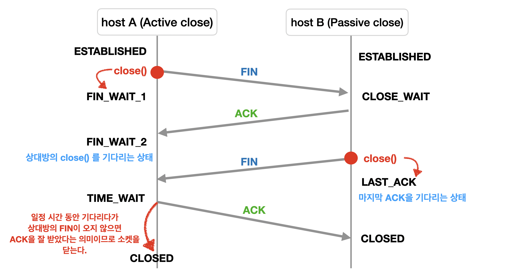
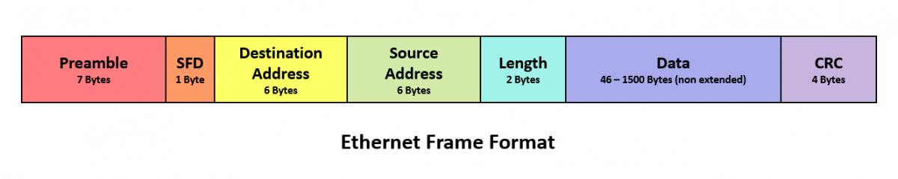
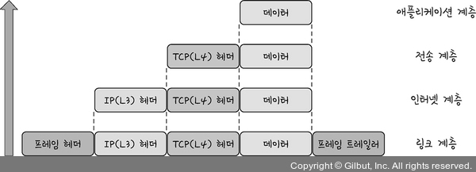
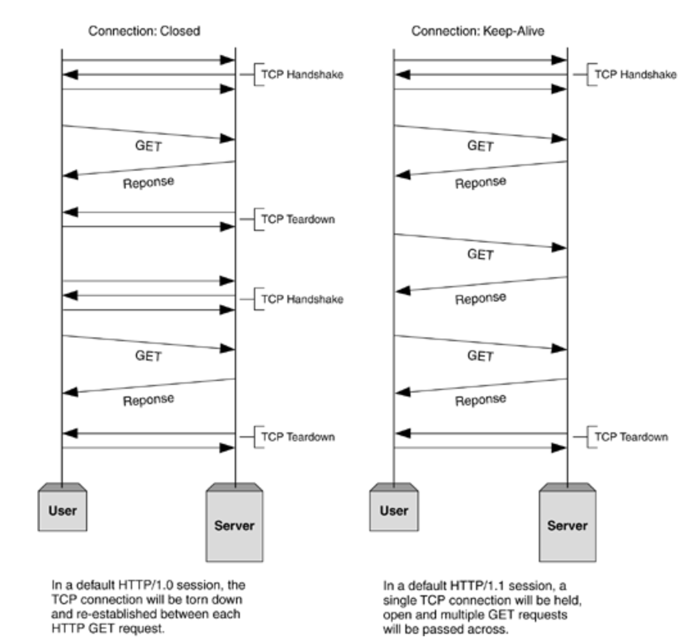
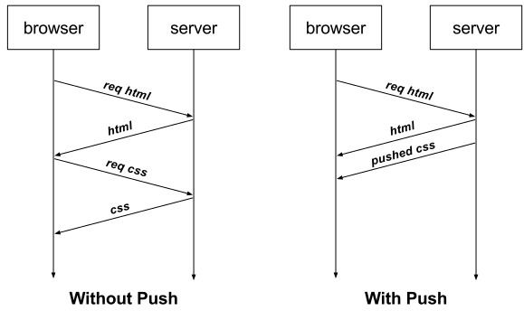
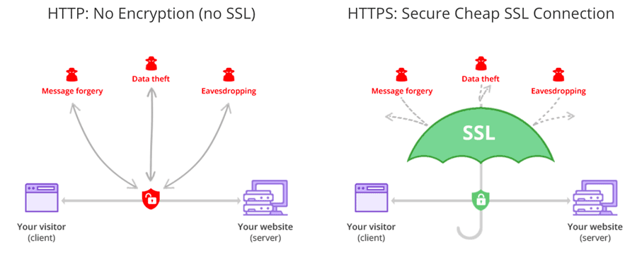
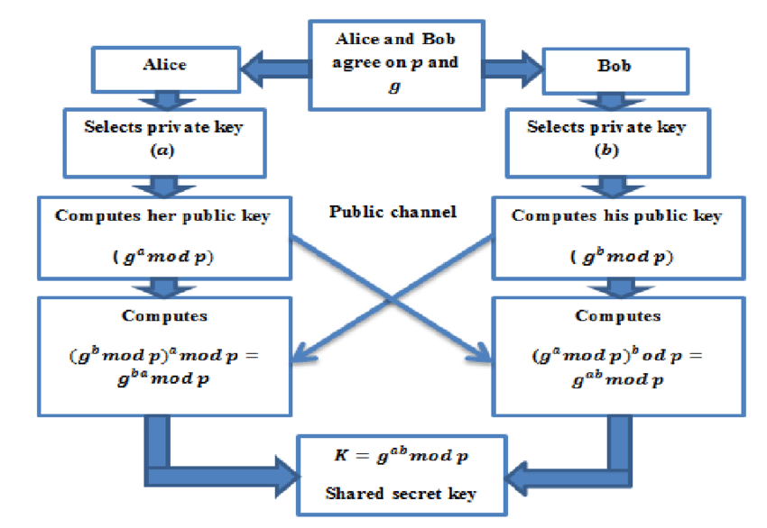

> 네트워크 : 컴퓨터 등의 장치들이 통신 기술을 이용하여 구축하는 연결망을 지칭하는 용어

# 2.1 네트워크의 기초
* 네트워크 : 노드(node)와 링크(link)가 서로 연결되어 있거나 연결되어 있지 않은 집합체
* 노드 : 서버, 라우터, 스위치 등 네트워크 장치
* 링크 : 유선 또는 무선

## 2.1.1 처리량과 지연 시간
**좋은 네트워크**
1. 많은 처리량을 처리할 수 있으며
2. 지연시간이 짧고
3. 장애 빈도가 적으며
4. 좋은 보안을 갖춘 네트워크

**처리량**
* 처리량(throughput) : 링크를 통해 전달되는 단위 시간당 데이터양
* 단위 : bps(bits per second) :point_right: 초당 전송 or 수신되는 비트 수
* 사용자들이 많이 접속할 때마다 커지는 **트래픽, 네트워크 장치 간의 대역폭, 네트워크 중간에 발생하는 에러, 장치의 하드에어 스펙**에 영향 받음
* 대역폭 : 주어진 시간 동안 네트워크 연결을 통해 흐를 수 있는 최대 비트 수

**지연 시간(latency)**
* 요청이 처리되는 시간
* 어떤 메시지가 두 장치 사이를 왕복하는 데 걸린 시간
* 매체 타입(무선, 유선), 패킷 크기, 라우터의 패킷 처리 시간에 영향 받음

## 2.1.2 네트워크 토폴로지와 병목 현상
**네트워크 토폴로지** : 노드와 링크가 어떻게 배치되어 있는지에 대한 방식이자 연결 형태
1. 트리 토폴로지 
   - 계층형 토폴로지
   - 트리 형태로 배치한 네트워크 구성
   - 장점 : 노드의 추가, 삭제가 쉽다
   - 단점 : 특정 노드에 트래픽이 집중될 때 하위 노드에 영향

2. 버스 토폴로지
   - 중앙 통신 회선 하나에 여러 개의 노드가 연결되어 공유하는 네트워크 구성
   - 근거리 통신망(LAN)에서 사용
   - 장점 : 설치 비용이 적고 신뢰성이 우수, 중앙 통신 회선에 노드를 추가하거나 삭제하기 쉽다.
   - 단점 : 스푸핑
    > 스푸핑 : LAN상에서 송신부의 패킷을 송신과 관련 없는 다른 호스트에 가지 않도록 하는 스위칭 기능을 마비시키거나 속여서 특정 노드에 해당 패킷이 오도록 처리하는 것 :point_right: 올바르게 수신부로 가야 할 패킷이 악의적인 노드에 전달됨

3. 스타 토폴로지
    - 중앙에 있는 노드에 모두 연결된 네트워크 구성
    - 장점 
      1. 노드를 추가하거나 에러를 탐지하기 쉽고 패킷의 충돌 발생 가능성이 적다.
      2. 어떠한 노드에 장애가 발생해도 쉽게 에어를 발견할 수 있다.
      3. 장애 노드가 중앙 노드가 아닐 경우 다른 노드에 적게 영향
    - 단점 
      1. 중앙 노드에 장애가 발생하면 전체 네트워크를 사용할 수 없다.
      2. 높은 설치 비용

4. 링형 토폴로지
    - 각각의 노드가 양 옆의 두 노드와 연결하여 전체적으로 고리처럼 하나의 연속된 길을 통해 통신을 하는 망 구성 방식
    - 데이터는 노드에서 노드로 이동, 각가그이 노드는 고리 모양의 길을 통해 패킷 처리
    - 장점
      1. 노드 수가 증가되어도 네트워크상의 손실이 거의 없고 충돌 발생 가능성이 적다.
      2. 노드의 고장 발견 쉬움
    - 단점
      1. 네트워크 구성 변경이 어렵고 회전에 장애가 발생하면 전체 네트워크에 영향

5. 메시 토폴로지
    - 망형 토폴로지라고도 하며, 그물망처럼 연결되어 있는 구조
    - 장점
      1. 한 단말 장치에 장애가 발생해도 여러 개의 경로가 존재하므로 네트워크를 계속 사용할 수 있다.
      2. 트래픽 분산 처리 가능
    - 단점
      1. 노드의 추가가 어려움
      2. 높은 구축 비용과 운용 비용

**병목 현상** 
- 전체 시스템의 성능이나 용량이 하나의 구성 요소로 인해 제한을 받는 현상
- 서비스에서 이벤트를 열었을 때 트래픽이 많이 생기고, 그 트래픽을 잘 관리하지 못하면 병목 현상이 생겨 사용자는 웹 사이트로 들어가지 못한다.

## 2.1.3 네트워크 분류
> 규모를 기반으로 LAN(Local Area Network)와 MAN(Metropolitan Area Network), WAN(Wide Area Network)로 분류

1. LAN 
    - 근거리 통신망
    - 같은 건물이나 캠퍼스같은 좁은 공간에서 운영
    - 전송 속도가 빠르고 혼잡하지 않다.

2. MAN
    - 대도시 지역 네트워크
    - 도시 같은 넓은 지역에서 운영
    - 전속 속도는 평균, LAN보다 혼잡

3. WAN
    - 광역 네트워크
    - 국가 또는 대륙 같은 더 넓은 지역에서 운영
    - 전송 속도는 낮고 MAN보다 혼잡

## 2.1.4 네트워크 성능 분석 명령어
네트워크 병목 현상의 주된 원인 :point_right: 네트워크 관련 테스트 + 네트워크 무관 테스트 로 네트워크의 문제점 확인
- 네트워크 대역폭
- 네트워크 토폴로지
- 서버 CPU, 메모리 사용량
- 비효율적인 네트워크 구성

1. ping(Packet INternet Groper)
    - 네트워크 상태를 확인하려는 대상 노드를 향해 일정 크기의 패킷을 전송하는 명령어
    - 해당 노드의 패킷 수신 상태와 도달하기까지의 시간 등을 알 수 있다
    - 해당 노드까지 네트워크가 잘 연결되어 있는지 확인할 수 있다.
    - TCP/IP 프로토콜 중에 ICMP 프로토콜을 통해 동작
    - 단점
       1. ICMP 프로토콜을 지원하지 않는 기기를 대상으로는 실행할 수 없다.
       2. 네트워크 정책상 ICMP나 traceroute를 차단하는 대상의 경우 ping 테스팅 불가

2. netstat
    - 접속되어 있는 서비스들의 네트워크 상태를 표시하는 데 사용
    - 네트워크 접속, 라우팅 테이블, 네트워크 프로토콜 등 리스트를 보여준다
    - 주로 서비스의 포트가 열려 있는지 확인할 때 씀

3. nslookup
    - DNS에 관련된 내용을 확인하는 명령어
    - 특정 도메인에 매핑된 IP 확인

4. tracert
    - 윈도우 : tracert | 리눅스 : traceroute
    - 목적지 노드까지 네트워크 경로를 확인하는 명령어
    - 목적지 노드까지 구간들 중 어느 구간에서 응답 시간이 느려지는지 등을 확인
5. 그 외
   - ftp : 대형 파일을 전송하여 테스팅
   - tcpdump : 노드로 오고 가는 패킷을 캡처
   - 네트워크 분석 프로그램 : wireshark, netmon

## 2.1.5 네트워크 프로토콜 표준화
**네트워크 프로토콜** 
- 다른 장치들끼리 데이터를 주고받기 위해 설정된 공통된 인터페이스
- 표준화 단체 IEEE, IETF 가 정함
- IEEE802.3 
    + 유선 LAN 프로토콜
    + 유선으로 LAN을 구축할 때 쓰이는 프로토폴
    + 만든 기업이 다른 장치라도 서로 데이터를 수신할 수 있음

- HTTP
    + 약속된 인터페이스인 HTTP를 통해 노드들이 웹 서비스를 기반으로 데이터를 주고받을 수 있음


# 2.2 TCP/IP 4계층 모델
**인터넷 프로토콜 스위트(internet protocol suite)**
- 인터넷에서 컴퓨터들이 서로 정보를 주고받는 데 쓰이는 프로토콜의 집합
- TCP/IP(Transmission Control Protocol/ Internet Protocol) 4계층 모델 or OSI 7계층 모델로 설명

### 2.2.1 계층 구조
- TCP/IP 계층 모델은 네트워크에서 사용되는 통신 프로토콜의 집합
- 계층들은 프로토콜의 네트워킹 범위에 따라 네 개의 수창화 계층으로 구성
- OSI7계층과의 차이 이미지 넣기
    > OSI 계층은 애플리케이션 계층을 세 개로 쪼개고 링크 계층을 데이터 링크 계층, 물리 계층으로 나누고 인터넷 계층을 네트워크 계층이라고 부른다.
- 계층들은 특정 계층이 변경되었을 때 다른 계층이 영향 받지 않도록 설계됨

1. 애플리케이션 계층
    - FTP, HTTP, SSH, SMTP, DNS 등이 사용되는 프로토콜 계층
       + FTP : 장치와 장치 간의 파일을 전송하는 데 사용되는 표준 통신 프로토콜
       + SSH : 보안되지 않은 네트워크에서 네트워크 서비스를 안전하게 운영하기 위한 암호화 네트워크 프로토콜
       + HTTP : World Wide Web을 위한 데이터 통신의 기초이자 웹 사이트를 이용하는 데 쓰는 프로토콜
       + SMPT : 전자 메일 전송을 위한 인터넷 표준 통신 프로토콜
       + DNS : 도메인 이름과 IP 주소를 매핑해주는 서버 :point_right: IP 주소가 바뀌어도 똑같은 도메인 주소로 서비스 가능
    - 웹 서비스, 이메일 등의 서비스를 실질적으로 제공

2. 전송 계층
    - 송신자와 수신자를 연결하는 통신 서비스 제공
    - 연결 지향 데이터 스트림 지원, 신뢰성, 흐름 제어 제공
    - 애플리케이션, 인터넷 계층 사이의 데이터가 전달될 때의 중계 역할
    - TCP
        + 패킷 사이의 순서를 보장
        + 연결지향 프로토콜을 사용해 연결 :point_right: 신뢰성 구축해서 수신 여부 확인
        + 가상회선 패킷 교환 방식
            - 각 패킷에 가상회선 식별자가 포함되며 모든 패킷을 전송하면 가상회선이 해제되고 패킷들이 전송된 **순서대로** 도착
    - UDP
        + 순서 보장 X
        + 수신 여부 확인 X
        + 데이터그램 패킷 교환 방식 :point_right: 단순히 데이터만 줌
            -  패킷이 독립적으로 이동하며 최적의 경로를 선택하여 갈 때, 하나의 메시지에서 분할된 여러 패킷은 서로 다른 경로로 전송될 수 있으며 도착한 **순서가 다를 수** 있는 방식

    * TCP 연결 성립 과정
        - TCP는 신뢰성을 확보할 때 **3-way handshake** 작업을 진행
        - 3-way handshake
        - 
            1. SYN (SYNchronization) 단계 : 클라이언트는 서버에 클라이언트의 ISN을 담아 SYN을 보낸다. 
                + ISN(Initial Sequence Numbers) : 초기 네트워크 연결을 할 때 할당된 32비트 고유 시퀀스 번호.    
                 새로운 TCP 연결의 첫 번째 패킷에 할당된 임의의 시퀀스 번호를 말하며 장치마다 다를 수 있다.
            2. SYN + ACK 단계 : 서버는 클라이언트의 SYN을 수신하고 서버의 ISN을 보내며 승인번호로 클라이언트의 ISN+1을 보냄
            3. ACK(ACKnowledgement) 단계 : 클라이언트는 서버의 ISN+1한 값인 승인번호를 담아 ACK를 서버에 보냄

    * TCP 연결 해제 과정
        - 4-way handshake 발생
        - 4-way handshake
        - 
            1. 클라이언트가 연결을 닫으려고 할 때 FIN으로 설정된 세그먼트를 보낸다.    
                클라이언트는 FIN_WAIT_1 상태로 들어가 서버의 응답을 기다린다.
            2. 서버는 클라이언트로 ACK라는 승인 세그먼트를 보내고 CLOSE_WAIT 상태에 들어간다.   
                클라이언트가 세그먼트를 받으면 FIN_WAIT_2 상태에 들어간다.
            3. 서버는 ACK를 보내고 일정 시간 이후에 클라이언트에 FIN이라는 세그먼트를 보낸다.
            4. 클라이언트는 TIME_WAIT 상태가 되고 다시 서버로 ACK를 보내서 서버는 CLOSED 상태가 된다.   
                이후 클라이언트는 어느 정도의 시간을 대기한 후 연결이 닫히고 클라이언트와 서버의 모든 자원의 연결이 해제된다.
        - :star2: TIME_WAIT가 필요한 이유
            + TIME_WAIT : 소켓이 바로 소명되지 않고 일정 시간 유지되는 상태
            + CentO56, 우분투 : 60초 | 윈도우 : 4분
            1. 지연 패킷이 발생할 경우를 대비하기 위해    
                :point_right: 패킷이 뒤늦게 도달하고 이를 처리하지 못하면 데이터 무결성 문제 발생 
                > 데이터 무결성(data integrity) : 데이터의 정확성과 일관성을 유지하고 보증하는 것
            2. 두 장치가 연결이 닫혔는지 확인하기 위해   
                :point_right: 만약 LAST_ACK 상태에서 닫히게 되면 다시 새로운 연결을 할 때 장치는 계속 LAST_ACK 상태이므로 접속 오류가 발생
                

3. 인터넷 계층
    * 장치로부터 받은 네트워크 패킷을 IP 주소로 지정된 목적지로 전송하기 위해 사용
    * IP, ARP, ICMP 등
    * 패킷을 수신해야 할 상대의 주소를 지정하여 데이터 전달
    * 상대방이 제대로 받았는지에 대해 보장하지 않는 비연결형적인 특징을 가진다.

4. 링크 계층
    * 전선, 광섬유, 무선 등으로 실질적으로 데이터를 전달
    * 장치 간에 신호를 주고 받는 '규칙'을 정함
    * 네트워크 접근 계층이라고도 한다.
    * 물리 게층과 데이터 링크 계층으로 나누기도 한다.
        - 물리 계층 : 무선 LAN과 유선 LAN을 통해 0과 1로 이루어진 데이터를 보내는 계층
        - 데이터 링크 계층 : '이더넷 프레임'을 통해 에러 확인, 흐름 제어, 접근 제어를 담당하는 계층
        - 
* 유선 LAN(IEEE802.3) : 유선 LAN을 이루는 이더넷은 IEEE802.3 프로토콜을 따르며 전이중화 통신을 사용
  + 전이중화 통신(full duplex) 
       - 양쪽 장치가 동시에 송수신할 수 있는 방식   
       - 송신로와 수신로로 나눠서 데이터를 주고받으며 현대의 고속 이더넷의 기반 방식이다.   
       - 양방향 통신이 가능 :arrow_right: 충돌 가능성이 없기 때문에 충돌 감지, 방지 메커니즘이 필요없다.

      
   + CSMA/CD (Carrier Sense Multiple Access with Collision Detection)   
       - 이전에 유선 LAN에 사용한 '반이중화 통신' 방식
       - 데이터를 **보낸 이후** 충돌이 발생한다면 일정 시간 이후 재전송하는 방식
       - 수신로와 수신로를 각각 둔 것이 아니고 한 경로를 기반으로 데이터를 보내기 때문에    
            데이터를 보낼 때 충돌에 대해 대비해야 했기 때문이다.

* 유선 LAN을 이루는 케이블
    1. 트위스트 페어 케이블 (Twisted Pair Cable, TP cable)
        + 여덟개의 구리선을 두 개씩 꼬아서 묶은 케이블
        + 종류 : UTP 케이블 (구리선을 실드 처리하지 않고 덮은 케이블), STP (구리선을 실드 처리하고 덮은 케이블)
        + LAN 케이블 : UTP 케이블 
        + 케이블 꽂는 커넥터 : RJ-45 커넥터

    2. 광섬유 케이블
        + 광섬유로 만든 케이블
        + 레이저를 이용해서 통신하기 때문에 구리선보다 장거리, 고속 통신 가능
        + 보통 100Gbps의 데이터 전송
        + 광섬유 내부와 외부를 다른 밀도를 가지는 유리나 플라스틱 섬유로 제작해서 한 번 들어간 빛이 내부에서 계속적으로 반사하며 전진하여 반대편 끝까지 가는 원리 이용
        + 코어(core) : 빛의 굴절률이 높은 부분
        + 클래딩(cladding) : 빛의 굴절률이 낮은 부분

* 무선 LAN(IEEE802.11)
    + 수신과 송신테 같은 채널 사용 :arrow_right: 반이중화 통신 사용
    + 반이중화 통신(half duplex)
      - 양쪽 장치는 통신할 수 있지만, 동시에는 통신할 수 없으며 한 번에 한 방향만 통신할 수 있는 방식
      - 장치가 신호를 수신하기 시작하면 응답하기 전에 전송이 완료될 때까지 기다려야 한다
      - 둘 이상의 장치가 동시에 전송하면 충돌이 발생하여 메시지가 손실되거나 왜곡될 수 있기 때문에 충돌 방지 시스템 필요   
       
    + CSMA/CA  
      - 장치에서 데이터를 보내기 전에 캐리어 감지 등으로 사전에 가능한 한 충돌을 방지하는 방식
      - 과정
          1. 데이터를 송신하기 전에 무선 매체를 살핀다.
          2. **캐리어 감지** : 회선이 비어 있는지 판단한다.
          3. **IFS**(Inter FrameSpace) : 랜덤 값을 기반으로 정해진 시간만큼 기다리며, 만약 무선 매체가 사용 중이면 점차 그 간격을 늘려가며 기다린다.
          4. 이후에 데이터를 송신한다.   

    + 무선 LAN을 이루는 주파수
        - 무선 LAN(WLAN, Wireless Local Area Network) : 무선 신호 전달 방식을 이용하여 2대 이상의 장치를 연결하는 기술
        - 비유도 매체인 공기에 주파수를 쏘아 무선 통신망 구축
        - 주파수 대역 : 2.4GHz 또는 5GHz 중 하나로 구축
        - 2.4GHz : 장애물에 강한 특성 but 전자레인지, 무선 등 전파 간섭이 일어나는 경우 많음
        - 5GHz : 사용할 수 있는 채널 수도 많고 동시에 사용할 수 있기 때문에 상대적으로 깨끗한 전파 환경 구축

    + 와이파이
        - 전자기기들이 무선 LAN 신호에 연결할 수 있게 하는 기술
        - 이용하려면 공유기 == 무선 접속 장치(AP, Access Point)가 있어야 한다
        - AP를 통해 유선 LAN에 흐르는 신호를 무선 LAN 신호로 바꿔주어 신호가 닿는 범위 내에서 무선 인터넷 사용 가능 
    
    + BSS(Basic Service Set)
        - 기본 서비스 집합
        - 단순 공유기를 통해 네트워크에 접속하는 것이 아닌 동일 BSS 내에 있는 AP들과 장치들이 서로 통신이 가능한 구조 
        - 근거리 무선 통신 제공
        - 하나의 AP만을 기반으로 구축이 되어 사용자가 다른 곳으로 이동하며 네트워크에 접속하는 것은 불가능 

    + ESS(Extended Service Set)
        - 하나 이상의 연결된 BSS 그룹
        - 장거리 무선 통신을 제공
        - BSS보다 더 많은 가용성, 이동성 지원
        - 사용자가 다른 곳으로 이동하며 중단 없이 네트워크에 연결 가능

* 이더넷 프레임
    + 데이터 링크 계층은 이더넷 프레임을 통해 전달받은 데이터의 에러를 검출하고 캡슐화한다.
    + 
        - Preamble : 이더넷 프레임이 시작임을 알린다.
        - SFD(Smart Frame Delimiter) : 다음 바이트부터 MAC 주소 필드가 시작됨을 알린다.
        - DMAC,SMAC : 수신, 송신 MAC 주소
            > MAC 주소 : 컴퓨터 등 장치 내에서 네트워크에 연결하기 위한 장치(LAN 카드)의 식별 번호. 6바이트(64비트)로 구성
        - EtherType : 데이터 계층 위의 계층인 IP 프로토콜 정의. ex) IPv4 or IPv6
        - Payload : 전달받은 데이터
        - CRC : 에러 확인 비트
       
* 계층 간 데이터 송수신 과정
    애플리케이션 :arrow_right: 요청(request) 캡슐화 :arrow_right: 전송계층
    :arrow_right: 링크 계층 - 해당 서버와 통신 - 서버의 링크 계층 ~비캡슐화~ 애플리케이션

* 캡슐화 과정   
    + 상위 계층의 헤더와 데이터를 하위 계층의 데이터 부분에 포함시키고 해당 계층의 헤더를 삽입하는 과정 
    + 
    + 애플리케이션 :arrow_right: 전송 : '세그먼트' or '데이터그램' 화되며 TCP(L4) 헤더 추가
    + 전송 계층 :arrow_right: 인터넷 계층 : IP(L3) 헤더 추가, '패킷'화
    + 인터넷 계층 :arrow_right: 링크 계층 : 프레임 헤더, 프레임 트레일러 추가 -> '프레임'화

* 비캡슐화 과정
    + 하위 계층에서 상위 계층으로 가며 각 계층의 헤더 부분을 제거하는 과정
    + 
    + 프레임화 :arrow_right: 패킷화 :arrow_right: 세그먼트, 데이터그램화 :arrow_right: 메시지화

## 2.2.2 PDU
* PDU(Protocol Data Unit)   
    + 네트워크의 어떤 계층에서 계층으로 데이터가 전달될 때 한 덩어리의 단위
    + 구성 
        - 헤더 : 제어 관련 정보 포함
        - 페이로드 : 데이터
    + 각 계층별 이름
        - 애플리케이션 계층 : 메시지(문자열)
            > 아래 계층인 비트로 송수신하는 것이 모든 PDU 중 가장 빠르고 효율성이 높지만    
            > 헤더에 authorization 값 등 다른 값들을 넣는 확장이 쉽기 때문에 문자열 사용
        - 전송 계층 : 세그먼트(TCP), 데이터그램(UDP)
        - 인터넷 계층 : 패킷
        - 링크 계층 : 프레임(데이터 링크 계층), 비트(물리 계층)
     

# 2.3 네트워크 기기

## 2.3.1 네트워크 기기의 처리 범위

* 계층별 
    + 상위 계층을 처리하는 기기는 하위 계층을 처리할 수 있지만 반대는 불가능
    + 애플리케이션 계층 : L7 스위치
    + 인터넷 계층 : 라우터, L3 스위치
    + 데이터 링크 계층 : L2 스위치, 브릿지
    + 물리 계층 : NIC, 리피터, AP

## 2.3.2 애플리케이션 계층을 처리하는 기기

* 스위치 
  - 여러 장비를 연결
  - 데이터 통신을 중재
  - 목적지가 연결된 포트로만 전기 신호를 보내 데이터를 전송하는 통신 네트워크 장비


* L7 스위치
    + 로드밸런서라고도 하며, 서버의 부하를 분산
    + 클라리언트로부터 오는 요청들을 뒤쪽의 여러 서버로 나누는 역할
    + 시스템이 처리할 수 있는 트래픽 증가가 목표
    + URL, 서버, 캐시, 쿠키들을 기반으로 트래픽 분산
    + 바이러스, 불필요한 외부 데이터 등을 걸러내는 필터링 기능
    + 응용 프로그램 수준의 트래픽 모니터링
    + 정기적으로 헬스 체크(health check)로 감시하여 장애가 발생한 서버를 트래픽 분산 대상에서 제외

* L4 스위치와 L7 스위치의 차이
    + L4 스위치 
        - 인터넷 계층을 처리
        - 스트리밍 관련 서비스에서는 사용 불가
        - 메시지를 기반으로 인식하지 못하고 IP와 주로 포트를 기반으로 트래픽 분산
    + L7 스위치
        - IP, 포트 외에도 URL, HTTP 헤더, 쿠키 등을 기반으로 트래픽 분산
        - ALB(Application Load Balancer) 컴포넌트 : 클라우드 서비스 (AWS 등)에서 L7 스위치를 이용한 로드밸런싱
        - NLB(Network Load Balancer) 컴포넌트 : L4 스위치를 이용한 로드밸런싱

* 헬스 체크
    + L4 스위치 또는 L7 스위치가 전송 주기와 재전송 횟수 등을 설정한 이후 반복적으로 서버에 요청을 보내는 것
    + 서버에 부하가 되지 않을 만큼 요청 횟수 적절해야 함
    + TCP, HTTP 등 여러 방법으로 요청을 보냄 :arrow_right: 이 요청이 정상적으로 이루어졌다면 정상적인 서버로 판별
    + 예) TCP 요청을 보냈는데 3-way handshake 가 정상적으로 일어나지 않으면 비정상 서버

* 로드밸런서를 이용한 서버 이중화
    + 로드밸런서가 2대 이상의 서버를 기반으로 가상 IP를 제공하여 이를 기반으로 안정적인 서비스 제공

## 2.3.3 인터넷 계층을 처리하는 기기

* 라우터
    + 여러 개의 네트워크를 연결, 분할, 구분시켜줌
    + 라우팅 : 다른 네트워크에 존재하는 장치끼리 서로 데이터를 주고받을 때, 패킷 소모를 최소화하고 경로를 최적화하여 최소 경로로 패킷을 포워딩

* L3 스위치
    + L2 스위치의 기능 + 라우팅 기능 (L3를 라우터라고 불러도 됨)
    + 라우터 = 소프트웨어 기반의 라우팅 + 하드웨어 기반의 라우팅(L3)
| 구분 | L2 스위치 | L3 스위치 |
|:---:|:---:|:---:|
|참조 테이블|MAC 주소 테이블|라우팅 테이블|
|참조 PDU|이더넷 프레임|IP 패킷|
|참조 주소|MAC 주소|IP 주소|

## 2.3.4 데이터 링크 계층을 처리하는 기기

* L2 스위치
    + 장치들의 MAC 주소를 MAC 주소 테이블을 통해 관리
    + 연결된 장치로부터 패킷이 왔을 때 패킷 전송 담당
    + IP 주소를 이해하지 못해 IP 주소 기반 라우팅 불가능
    + 단순히 패킷의 MAC 주소를 읽어 스위칭
    + 목적지가 MAC 주소 테이블에 없다면 전체 포트에 전달하고 MAC 주소 테이블의 주소는 일정 시간 이후 삭제하는 기능 有

* 브릿지
    + 두 개의 근거리 통신망(LAN)을 상호 접속할 수 있도록 하는 통신망 연결 장치
    + 포트와 포트 사이의 다리 역할
    + 장치에서 받아온 MAC 주소를 MAC 주소 테이블로 관리
    + 통신망 범위를 확장하고 서로 다른 LAN 등으로 이루어진 '하나의' 통신망을 구축 할 때 사용

## 2.3.5 물리 계층을 처리하는 기기

* NIC(Network Interface Card, LAN 카드)
    + 2대 이상의 컴퓨터 네트워크를 구성하는 데 사용
    + 네트워크와 빠른 속도로 데이터를 송수신할 수 있도록 컴퓨터 내에 설치하는 확장 카드
    + 각 LAN 카드에는 고유의 식별번호인 MAC 주소가 존재

* 리피터(repeater)
    + 약해진 신호 정도를 증폭하여 다른 쪽으로 전달하는 장치
    + 패킷이 더 멀리 갈 수 있게 함
    + 광케이블이 보급된 후 현재는 잘 쓰이지 않음

* AP(Access Point)
    + 패킷을 복사하는 기기
    + AP에 유선 LAN을 연결한 후 다른 장치에서 무선 LAN 기술(와이파이 등)을 사용하여 무선 네트워크 연결을 할 수 있다.


# 2.4 IP 주소

## 2.4.1 ARP

* ARP(Address Resolution Protocol) : IP 주소로부터 MAC 주소를 구하는 기능, IP와 MAC 주소의 다리 역할을 하는 프로토콜
    + 가상 주소인 IP 주소를 실제 주소인 MAC 주소로 변환
    + RARP : 실제 주소인 MAC 주소를 가상 주소인 IP 주소로 변환
    + 예) 장치 A : ARP Request 브로드캐스트를 보내 IP 주소가 120.70.80.3에 해당하는 MAC 주소 찾음   
        그 MAC 주소인 장치 B : ARP reply 유니캐스트를 통해 MAC 주소를 반환 
    > 브로드 캐스트  : 송신 호스트가 전송한 데이터가 네트워크에 연결된 모든 호스트에 전송되는 방식
    > 유니캐스트 : 고유 주소로 식별된 하나의 네트워크 목적지에 1:1로 데이터를 전송하는 방식

## 2.4.2 홉바이홉 통신

* 홉바이홉(hop by hop) 통신 
    + IP 주소를 통해 통신하는 과정
    + 각각의 라우터에 있는 라우팅 테이블의 IP를 기반으로 패킷을 전달하고 다시 전달
    + 통신 장치에 있는 '라우팅 테이블'의 IP를 통해 시작 주소부터 시작하여 다음 IP로 계속해서 이동하는 '라우팅' 과정을 거쳐 패킷이 최종 목적지까지 도달하는 통신

* 라우팅 테이블(routing table)
    + 송신지에서 수신지까지 도달하기 위해 사용
    + 라우터에 들어가 있는 목적지 정보들과 그 목적지로 가기 위한 방법이 들어 있는 리스트
    + 게이트웨이와 모든 목적지에 대해 해당 목적지에 도달하기 위해 거쳐야 할 다음 라우터의 정보를 가지고 있음

* 게이트웨이
    + 서로 다른 통신망, 프로토콜을 사용하는 네트워크 간의 통신을 하능하게 하는 관문 역할을 하는 컴퓨터, 소프트웨어 등
    + 서로 다른 네트워크상의 통신 프로토콜을 변환
    + 윈도우 cmd에서 netstat -r 명령어로 라우팅 테이블 통해 확인 가능

## 2.4.3 IP 주소 체계

* IPv4 : 32비트를 8비트 단위로 점을 찍어 표기 123.45.67.89 :arrow_right: 현재 가장 많이 쓰이는 주소 체계
* Ipv6 : 64비트를 16비트 단위로 점을 찍어 표기 2001:db8::ff00:42:8329

### 클래스 기반 할당 방식

* 초기 클래스 기반 할당 방식(CIDR)
    + (앞)네트워크 주소 + (중간) 컴퓨터에 부여하는 호스트 주소 + (뒤) 브로드캐스트용 주소 :arrow_right: 네트워크에 속해 있는 모든 컴퓨터에 데이터를 보냄
    + 중간에 있는 주소만 호스트 주소로 사용하기 때문에 버리는 주소가 많은 단점 :arrow_right: DHCP, IPv6,NAT 로 해소
    + 클래스 A,B,C : 일대일 통신
    + 클래스 D : 멀티캐스트 통신
    + 클래스 E : 예비용
    + 구분 비트
        - A : 0, IP 범위 : 0.0.0.0 ~ 127.255.255.255
        - B : 10
        - C : 110

* DHCP(Dynamic Host Configuration Protocol)
    + IP 주소 및 기타 통신 매개변수를 자동으로 할당하기 위한 네트워크 관리 프로토콜
    + 네트워크 장치의 IP 주소를 수동으로 설정할 필요 없이 인터넷에 접속할 때마다 자동으로 IP 주소를 할당할 수 있다.
    + 라우터와 게이트웨이 장비에 DHCP 기능이 있다.
    + 대부분의 가정용 네트워크에서 IP 주소를 할당한다.

* NAT(Network Address Translation)
    + 패킷이 라우팅 장치를 통해 전송되는 동안 패킷의 IP 주소 정보를 수정하여 IP 주소를 다른 주소로 매핑하는 방법
    + IPv4로는 많은 주소들을 모두 감당하지 못함 :arrow_right: NAT로 공인 IP와 사설 IP로 나눠서 많은 주소 처리
    + 사설 IP :left_right_arrow: 공인 IP
    + NAT 가능 소프트웨어 : ICS, RRAS, Netfilter
    + 여러 대의 호스트가 하나의 공인 IP 주소를 사용하여 인터넷에 접속하기 위해
    + 인터넷 공유기에 NAT 기능이 탑재되어 있어서 인터넷 회선 하나로 여러 대의 PC 연결 가능
    + 내부 내트워크에서 사용하는 IP 주소와 외부에 드러나는 IP 주소를 다르게 유지할 수 있어서 내부 네트워크에 대한 보안 가능
    + 단점 : 접속하는 호스트 숫자에 따라 접속 속도가 느려질 수 있다.

## 2.4.4 IP 주소를 이용한 위치 정보
IP 주소는 인터넷에서 사용하는 네트워크 주소이기 때문에 이를 통해 위치 추적이 가능함

# 2.5 HTTP
> HTTP는 애플리케이션 계층으로서 웹 서비스 통신에 사용

## 2.5.1 HTTP/1.0
> HTTP/1.0은 기본적을 한 연결당 하나의 요청을 처리하도록 설계 :arrow_right: RTT 증가 

### RTT 증가

* RTT : 패킷이 목적지에 도달하고 나서 다시 출발지로 돌아오기까지 걸리는 시간, 패킷 왕복 시간
* 서버로부터 파일을 가져올 때마다 TCP의 3-웨이 팬스셰이크를 계속 열어야 하기 때문에 RTT가 증가한다.

### RTT의 증가 해결법

* 이미지 스플리팅
    + 과부하를 피하기 위해 많은 이미ㅣ가 합쳐 있는 하나의 이미지를 다운로드
    + background-image의 position을 이용하여 이미지를 표기하는 방법
    + css) background-image: url("icon.png");, background-position 기반

* 코드 압축
    + 코드를 압축해서 개행 문자, 빈칸을 없애서 코드의 크기를 최소화

* 이미지 Base64 인코딩
    + 이미지 파일을 64진법으로 이루어진 문자열로 인코딩
        > 인코딩 : 정보ㅡ이 형태나 형식을 표준화, 보안, 처리 속도 향상, 저장 공간 절약 들을 위해 다른 현태나 형식으로 변환 
    + 서버와의 연결을 열고 이미지에 대해 서버에 HTTP 요청을 할 필요가 없다
    + 단점 : Base64 문자열로 변환할 경우 크기가 약 37% 증가

## 2.5.2 HTTP/1.1



### HTTP/1.1
    + 매번 TCP 연결을 하는 것이 아니라 한번 TCP 초기화를 한 이후에 keep-alive 라는 옵션으로 여러 개의 파일을 송수신할 수 있음
    + HTTP/1.0에도 keep-alive가 존재하지만 HTTP/1.1 부터 표준화되어 기본 옵션
    + 한 번 TCP 3-way handshake가 발생하면 그 이후 발생하지 않는다.
    + 단점 : 문서 안에 포함된 다수의 리소스를 처리하려면 요청할 리소스(이미지, css,script 파일) 개수에 비례해서 대기 시간이 길어짐
    + 헤더에 쿠키 등 많은 메타데이터가 들어 있고, 압축이 되지 않아 무거움

### HOL Blocking (Head Of Line Blocking)
    + 네트워크에서 같은 큐에 있는 패킷이 그 첫 번째 패킷에 의해 지연될 때 발생하는 성능 저하 현상

## HTTP/2

> HTTP/2 : SPDY 프로토콜에서 파생된 HTTP/1.x 보다 지연 시간을 줄이고 응답 시간이 더 빠름.    
>           멀티플렉싱, 헤더 압축, 서버 푸시, 요청의 우선순위 처리를 지원하는 프로토콜

### 멀티플렉싱
* 여러 개의 스트림을 사용하여 송수신
* 특정 스트림의 패킷이 손실되어도 해당 스트림에만 영향을 미침
    > 스트림 : 시간이 지남에 따라 사용할 수 있게 되는 일련의 데이터 요소를 가리키는 데이터 흐름
* 
    + 병렬적인 스트림(stream)들을 통해 데이터 서빙
    + 스트림 내의 데이터들도 쪼개져 있음
    + 애플리케이션에서 받아온 독립된 프레임으로 조각내어 서로 송수신한 이후 다시 조립하며 데이터 주고받음
* 단일 연결을 사용하여 병렬로 여러 요청을 받을 수 있고 응답을 줄 수 있다.
* HTTP/1.x에서 발생하는 HOL blocking 해결 가능

### 헤더 압축
* 허프만 코딩 압축 알고리즘을 사용하는 HPACK 압축 형식
    + 허프만 코딩(huffman coding)
        - 문자열을 문자 단위로 쪼개 빈도수를 세어 빈도가 높은 정보는 비트 수를 적게, 빈도가 낮은 정보는 비트 수를 많이 사용해 전체 데이터의 표현에 필요한 비트양을 줄이는 원리

### 서버 푸시
* 
* HTTP/1.1에서는 클라이언트가 서버에 요청을 해야 파일 다운로드 가능
* HTTP/2 는 클라이언트 요청 없이 서버가 바로 리소스를 푸시
* html을 읽으면서 그 안에 들어 있는 css 파일을 서버에서 푸시하여 클라이언트에 먼저 줄 수 있음

## 2.5.4 HTTPS

* HTTPS : 애플리케이션 계층과 전송 계층 사이에 신뢰 계층인 SSL/TLS 계층을 넣은 신뢰할 수 있는 HTTP 요청 :point_right: 통신을 암호화
* HTTP/2는 HTTPS 위에서 동작
 
### SSL/TLS

* SSL(Secure Socket Layer) 1.0 붙터 시작해 TLS(Transport Layer Security Protocol) 1.3 까지 올라가면서 명칭이 TLS로 변경되었으나 통칭 SSL/TLS 
 
* 전송 계층에서 보안을 제공하는 프로토콜
* 클라이언트와 서버가 통신할 때 SSL/TLS를 통해 제3자가 메시지를 도청하거나 변조하지 못하도록 함
* 
* 공격자가 서버인 척하며 사용자 정보를 가로채는 네트워크상의 **인터셉터** 방지 가능
* 핸드셰이크를 통해 생성한 보안 세션을 기반으로 데이터를 암호화, 상태 정보 공유
* 보안 세션이 만들어질 때 인증 메커니즘, 키 교환 암호화 메커니즘, 해싱 알고리즘 사용
    > 보안 세션 : 보안이 시작되고 끝나는 동안 유지되는 세션
    > 세션 : 운영체제가 어떠한 사용자로부터 자신의 자산 이용을 허락하는 일정한 기간
* 클라이언트와 서버는 키를 공유하고 이를 기반으로 인증, 인증 확인 등의 작업이 일어나는 한 번의 ==1-RTT==가 생긴 후 데이터 송수신
* 0-RTT : TLS 1.3은 사용자가 이전에 방문한 사이트를 다시 방문해도 SSL/TLS에서 보안 세션을 만들 때 걸리는 통신을 하지 않아도 됨
* 클라이언트에서 사이퍼 슈트(cyper suites)를 서버에 전달하면 서버는 받은 사이퍼 슈트의 암호화 알고리즘 리스트를 제공할수 있는지 확인   
    :point_right: 제공할 수 있다면 서버에서 클라이언트로 인증서를 보내는 인증 메커니즘 시작   
    :point_right: 해싱 알고리즘 등으로 암호화된 데이터의 송수신 시작

* 사이퍼 슈트 : 프로토콜, AEAD 사이퍼 모드, 해싱 알고리즘이 나열된 규악. 다섯 개가 있다.
    + TLS_AES_128_GCM_SHA256 : TLS 프로토콜 + AEAD 사이퍼 모드(AES_128_GCM) + 해싱 알고리즘(SHA256)
    + TLS_AES_256_GCM_SHA384
    + TLS_CHACHA20_POLY1305_SHA256
    + TLS_AES_128_CCM_SHA256
    + TLS_AES_128_CCM_8_SHA256

* AEAD(Authenticated Encryption with Associated Data) 사이퍼 모드
    + 데이터 암호화 알고리즘
    + 예) AED_128_GCM : 128비트의 키를 사용하는 표준 블록 암호화 기술과 병렬 계산에 용이한 암호화 알고리즘 GCM이 결합돤 알고리즘

* 인증 메커니즘
    + CA(Certificate Authorities)에서 발급한 인증서를 기반으로 이루어짐
        - CA 기업 : Comodo, GoDaddy, GlobalSign, 아마존 등
        - CA 발급 과정 
            1. 사이트 정보와 공개키를 CA에 제출
            2. CA는 공개키를 해시한 값인 지문(finger print)을 사용하는 CA의 비밀키(개인키) 등을 기반으로 CA 인증서 발급 
    + 인증서 
        - 안전한 연결에 필요한 ==공개키==를 클라이언트에 제공하고 사용자가 접속한 서버가 신뢰할 수 있는 서버임을 보장
        - 서비스 정보, 공개키, 지문, 디지털 서명 등으로 이루어짐

* 암호화 알고리즘
    + 키 교환 암호화 알고리즘 
      - 대수곡선 기반의 ECDHE(Elloptic Curve Diffie-Hellman Ephermeral) 
      - 모듈식 기반의 DHE(Diffie-Hellman Ephermeral)
    + Diffie-Hellman 키 교환 암호화 알고리즘
        -  
        - g,x,p를 안다면 y는 구하기 쉽지만, q,y,p만 안다면 x를 구하기는 어렵다는 원리
        - 처음에 공개 값을 공유하고 각자의 비밀 값과 혼합한 후 혼합값 공유 :point_right: 그다음 각자의 비밀 값과 또 혼합   
             :arrow_right: PSK(사전 합의된 비밀키) 생성
    
    + 해싱 알고리즘
        - SSL/TLS는 해싱 알고리즘으로 SHA-256, SHA-384 사용
        - SHA-256
            + 해시 함수의 결과값이 256비트인 알고리즘
            + 블록체인 시스템에서도 사용
            + 해싱을 해야 할 메시지에 1을 추가하는 등 전처리를 하고 전처리된 메시지를 기반으로 해시 반환


### SEO에도 도움이 되는 HTTPS

* SEO(Search Engine Optimization)
    + 검색엔진 최적화
    + 사용자들이 검색엔진으로 웹 사이트를 검색했을 때 결과를 페이지 상단에 노출시켜 많은 사람이 볼 수 있도록 최적화하는 방법
    + 캐노니컬 설정, 메타 설정, 페이지 속도 개선, 사이트맵 관리 등이 있음

* 캐노니컬 설정
    + link에 캐노니컬을 설정
```html
   <link rel="canonical href="https://example.com/page2.php"/>
```

* 메타 설정
    + html 파일의 가장 윗부분인 메타를 잘 설정한다

* 페이지 속도 개선
    + 구글의 PAgeSpeedInsights에서 서비스에 대한 리포팅을 받아 관리

* 사이트맵 관리
    + sitemap.xml 정기적으로 관리

### HTTPS 구축 방법
1. 직접 CA에서 구매한 인증키를 기반으로 HTTPS 서비스를 구축
2. 서버 앞단의 HTTPS를 제공하는 로드밸런서를 두고 구축
3. 서버 앞단에 HTTPS를 제공하는 CDN을 둬서 구축


## 2.5.5 HTTP/3

* QUIC 계층 위에서 UDP 기반으로 돌아감 
    > QUIC는 순방향 오류 수정 메커니즘(FEC, Forward Error Correction) 적용   
    > :point_right: 전송한 패킷이 손실되면 수신 측에서 에러를 검출, 수정    
    > :point_right: 열악한 네트워크 환경에서도 낮은 패킷 손실률
*  
* 장점
    + 멀티플렉싱
    + 초기 연결 설정 시 지연 시간 감소

* 초기 연결 설정 시 지연 시간 감소
    + QUIC는 TCP를 사용하지 않기 때문에 통신을 시작할 때 3-way handshake 거치지 않음
    + QUIC는 첫 연결 설정에 1-RTT만 소요   
        :point_right: 클라이언트가 서버에 어떤 신호를 한 번 주고, 서버도 거기에 응답하면 바로 본 통신 시작
    