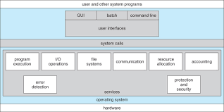

# 운영체제(OS, Operating System)

- 사용자가 컴퓨터를 쉽게 다루게 해주는 인터페이스
- 한정된 메모리나 시스템 자원을 효율적으로 분배
- 펌웨어 : 운영체제와 유사하지만 sw를 추가로 설치할 수 없음

# 3.1 운영체제와 컴퓨터

## 3.1.1 운영체제의 역할과 구조

### 운영체제의 역할

1. CPU 스케줄링과 프로세스 관리 : CPU 소유권 할당, 프로세스 생성 및 억제, 자원 할당 및 반환
2. 메모리 관리 : 한정된 메모리를 어떤 프로세스에 얼만큼 할당하는지 관리
3. 디스크 파일 관리 : 디스크 파일을 어떤 방식으로 보관할지 관리
4. I/O 디바이스 관리

### 운영체제의 구조

- GUI : 명령어 창이 아닌 아이콘을 마우스로 클릭하여 컴퓨터와 상호작용
  - GUI가 없고 CUI만 있는 리눅스 서버도 있다
- 드라이버 : 하드웨어를 제어하기 위한 소프트웨어
- CUI : 명령어로 처리하는 인터페이스

[!시스템콜](./images/system_call.jpeg)

- 시스템콜

  - 운영체제가 커널에 접근하기 위한 인터페이스
  - 유저 프로그램이 운영체제의 서비스를 받기 위해 커널 함수를 호출할 때 씀
  - 유저 프로그램의 I/O 요청이 올바른 지 확인한 후 유저 모드가 시스템콜을 통해 커널 모드로 변환되어 실행
    - I/O 요청 : 입출력 함수, DB 네트워크, 파일 접근 등에 관한 일
    - 드라이버 : 하드웨어를 제어하기 위한 sw
  - 하나의 추상화 계층 :point_right: 네트워크 통신이나 데이터베이스 같은 낮은 단계의 영역 처리에 대한 부분을 신경 쓰지 않고 프로그램 구현 가능

- modebit
  - 1 또는 0의 값을 가지는 플래그 변수
  - 시스템콜이 작동될 때 modebit을 참고해서 유저 모드와 커널 모드를 구분
  - 0 : 커널 모드
  - 1 : 유저 모드 :pint_right: 시스템콜을 못하게 막아서 한정된 일만 가능하게 함
    - 유저 모드 : 유저가 접근할 수 있는 영역을 제한적으로 두며 컴퓨터 자원에 함부로 침범하지 못하는 모드
    - 커널 모드 : 모든 컴퓨터 자원에 접근할 수 있는 모드
    - 커널 : OS의 핵심부분. 시스템콜 인터페이스 제공

## 3.1.2 컴퓨터의 요소

- CPU(Central Processing Unit)

  - 산술논리연산장치, 제어장치, 레지스터로 구성
  - 인터럽트에 의해 메모리에 존재하는 명령어를 해석해서 실행

- 제어장치(CU, Control Unit)

  - 프로세스 조작을 지시하는 CPU의 부품
  - 입출력장치 간 통신 제어
  - 명령어 읽고 해석하여 데이터 처리를 위한 순서 결정

- 레지스터

  - CPU 안에 있는 임시기억장치
  - CPU와 직접 연결되어 있어 연산 속도가 매우 빠름
  - CPU는 자체적으로 데이터를 저장할 방법이 없어 레지스터를 거쳐 데이터를 전달

- 산술논리연산장치(ALU, Arithmetic Logic Unit)

  - 두 숫자의 산술 연산과 논리 연산 계산

- CPU의 연산 처리

  1. 제어장치가 메모리, 레지스터에 계산할 값 로드
  2. 제어장치가 레지스터에 있는 값을 계산하라고 ALU에 명령
  3. 제어장치가 계산된 값을 레지스터에서 메모리로 저장

- 인터럽트

  - 어떤 신호가 들어왔을 때 CPU를 잠깐 정지시킴
  - 인터럽트가 발생하면 인터럽트 핸들러 함수가 모여 있는 인터럽트 벡터로 가서 인터럽트 핸들러 함수 실행
  - 인터럽트 간에는 우선순위가 있어 이에 따라 실행
  - 하드웨어 인터럽트
    - I/O 디바이스에서 발생
    - 인터럽트 라인 설계된 이후 인터럽트 실행을 중지 :point_right: 운영체제에 시스템콜을 요청해서 원하는 디바이스에 있는 로컬 버퍼에 접근하여 일 수행
  - 소프트웨어 인터럽트 (trap)
    - 프로세스가 시스템콜을 호출할 때 발생

- DMA 컨트롤러

  - I/O 디바이스가 메모리에 직접 접근할 수 있도록 하는 HW 장치
  - CPU에만 너무 많은 인터럽트 요청이 들어와 CPU 부하를 막아 CPU의 일을 부담하는 보조
  - 하나의 작업을 CPU와 DMA 컨트롤러가 동시에 하는 것을 방지

- 메모리

  - 전자회로에서 데이터, 상태, 명령어 등 기록하는 장치
  - RAM(Random Access Memory)
  - CPU는 계산, 메모리는 기억

- 타이머

  - 특정 프로그램에 시간 제한을 부여
  - 시간이 많이 걸리는 프로그램이 작동할 때 제한을 걸기 위해 존재

- 디바이스 컨트롤러
  - 컴퓨터와 연결되어 있는 I/O 디바이스들의 CPU

## 3.2 메모리

### 3.2.1 메모리 계층

[!메모리계층](images/memory.png)

- 레지스터

  - CPU 안에 있는 메모리
  - 휘발성, 속도 가장 빠름.
  - 기억 용량 가장 적음

- 캐시

  - L1, L2 캐시 지칭
  - 휘발성,속도 빠름
  - 기억 용량 적음

- 주기억장치

  - RAM
  - 휘발성,속도 보통
  - 기억 용량 보통
  - 하드디스크로부터 일정량의 데이터를 복사해서 임시 저장하고 필요 시마다 CPU에 전달

- 보조기억장치

  - HDD, SDD
  - 휘발성, 속도 낮음
  - 기억 용량 많음

- 캐시(cache)

  - 데이터를 미리 복사해 놓는 임시 저장소
  - 장치의 속도 차이에 따른 병목 현상을 줄이기 위한 메모리
  - 데이터를 접근하는 시간이 오래 걸리는 경우를 해결하고 다시 계산하는 시간을 절약
  - 개싱 계층 : 속도를 해결하기 위해 계층과 계층 사이에 있는 계층
  - 메모리와 CPU 사이의 속도 차이가 너무 커서 중간에 레지스터 계층을 둬서 속도 차이 해결
  - 캐시 메모리 - 주기억장치(캐싱 계층) - 보조기억장치

- 지역성의 원리
  - 자주 사용하는 데이터를 기반으로 캐시 설정
  - 시간 지역성(temporal locality)
    - 최근 사용한 데이터에 다시 접근하려는 특성
  - 공간 지역성(spatial locality)
    - 최근 접근한 데이터를 이루고 있는 공간이나 그 가까운 공간에 접근하는 특성

[!캐시히트,미스](images/cachehit.png)

- 캐시히트
  - 캐시에서 원하는데이터를 찾음
  - 제어장치를 거쳐 해당 데이터를 가져오와 위치도 가깝고 CPU 내부 버스를 기반으로 작동해서 빠름
- 캐시미스

  - 해당 데이터가 캐시에 없다면 주메모리로가서 데이터를 찾아오는 것
  - 메모리에서 가져오면서 시스템 버스를 기반으로 작동하기 때문에 느리다

- 캐시매핑

  - 캐시가 히트되기 위해 매핑하는 방법
  - CPU의 레지스터(메모리 작음)와 주 메모리(RAM, 메모리 큼) 간에 데이터를 주고받을 때 레지스터가 매핑을 통해 캐시 계층 역할 수행
    |이름|설명|
    |---|---|
    |직접 매핑(directed mapping)|메모리 1~100, 캐시 1~10 :point_right: 1:1~10, 2:1~20, 빠른 처리 + 잦은 충돌|
    |연관 매핑(associative mapping)|순서를 일치시키지 않고 관련 있는 캐시와 메모리 매핑, 느린 처리 + 적은 충돌(모든 블록 탐색)|
    |집합 연관 매핑(set associative mapping)|직접+연관, 순서 일치 + 집합으로 저장 :point_right: 효율적 검색|

- 웹 브라우저의 캐시

  - 사용자의 커스텀 정보, 인증 모듈 관련 사항들을 웹 브라우저에 저장해서 추후 서버에 요청할 때 자신을 나타내는 아이덴티티나 중복 요청 방지를 위해 쓴다.
  - 쿠키

    - 만료기한 있는 키-값 저장소
    - same site 옵션을 strict로 설정하지 않았을 경우 도메인에서 요청했을 때 자동 전송
    - 4KB까지 저장, 만료기한 가능
    - 쿠키 설정 시 document.cookie로 쿠키를 볼 수 없게 httponly 옵션을 거는 것이 중요
    - 클라이언트 또는 서버에서 만료기한 등을 정할 수 있는데 보통 서버에서 정함

  - 로컬 스토리지

    - 만료기한 없는 키-값 저장소
    - 10MB까지 저장
    - 웹 브라우저를 닫아도 유지
    - 도메인 단위로 저장, 생성
    - HTML5를 지원하지 않는 웺브라우저에서는 사용불가
    - 클라이언트에서만 수정 가능

  - 세션 스토리지
    - 만료기한 없는 키-값 저장소
    - 탭 단위로 세션 스토리지 생성, 탭 닫을 때 해당 데이터 삭제
    - 5MB까지 저장
    - HTML5를 지원하지 않는 웺브라우저에서는 사용불가
    - 클라이언트에서만 수정 가능

- 데이터베이스의 캐싱 계층
  - 메인 데이터베이스 위에 레디스(redis) 데이터데이스 계층을 '캐싱 계층'으로 둬서 성능 향상
  - [!redis](images/redis.png)

### 3.2.2 메모리 관리

- 가상 메모리(virtual memory)

  - 컴퓨터가 실제로 이용 가능한 메모리 자원을 추상화하여 사용자들에게 큰 메모리로 보이게 만드는 것
  - 가상 주소(logical address) : 가상으로 주어진 주소
  - 실제 주소(physical address) : 실제 메모리상에 있는 주소
  - 가상 주소는 메모리관리장치(MMU)에 의해 실제 주소로 변환
  - 패이지 테이블 : 가상 주소와 실제 주소가 매핑, 프로세스의 주소 정보가 들어 있어 이를 통해 가상 메모리를 관리
    - TLB
      - 메모리와 CPU 사이에 있는 주소 변환을 위한 캐시
      - 페이지 테이블에 있는 리스트를 보관하며 CPU가 페이지 테이블까지 가지 않도록 해서 속도를 향상시키는 캐시 계층

- 스와핑

  - 페이지 폴트 방지
  - 당장 사용하지 않는 영역을 하드디스크로 옮겨 필요할 때는 RAM으로 올리고, 안 필요할 때는 하드 디스크로 내림

- 페이지 폴트(page fault)

  - 프로세스의 주소 공간에는 존재하지만 지금 컴퓨터의 RAM에는 없는 데이터에 접근할 때 발생
  - 페이지 : 가상 메모리를 사용하는 최소 크기 단위
  - 프레임 : 실제 메모리를 사용하는 최소 크기 단위
  - 페이지 폴트와 스와핑 과정
    1. CPU는 물리 메모리를 확인하여 해당 데이터가 없으면 트랩을 발생하여 OS에 알림
    2. OS는 CPU의 동작을 멈춤
    3. OS는 페이지 테이블을 확인하여 가상 메모리에 페이지가 존재하는지 확인하고, 없으면 프로세스를 중단하고 현재 물리 메모리에 비어 있는 프레임이 있는지 찾는다. 물리 메모리에도 없다면 스와핑 발생
    4. 비어 있는 프레임에 해당 페이지를 로드하고, 페이지 테이블을 최신화
    5. 중단된 CPU 다시 시작

- 스레싱(thrashing)
  [!스레싱](images/thrashing.png)

  - 메모리의 페이지 폴트율이 높은 것 :point_right: 컴퓨터의 심각한 성능 저하 초래
  - 메모리에 너무 많은 프로세스가 동시에 올라가게 되면 스오ㅓ핑이 많이 일어나 발생
  - 페이지 폴트가 발생하면 CPU 이용률이 낮아짐 :point_right: 가용률을 높이기 위해 더 많은 프로세스를 메모리에 올림 :point_right: 악순환 반복
  - 해결 방법
    - 메모리를 늘림
    - HDD를 SDD로 변경
    - OS에서의 해결 방법 : 작업 세트, PFF

- 작업 세트(working set)

  - 프로세스의 과거 사용 이력인 지역성(locality)을 통해 결정된 페이지 집합을 만들어 미리 메모리에 로드
  - 탐색 비용 감소, 스와핑 감소

- PFF(Page Fault Frequency)

  - 페이지 폴트 빈도 조절
  - 상한선과 하한선을 만들어 상한선에 도달하면 페이지를 늘리고 하한선에 도달하면 페이지를 줄임

- 메모리 할당
  - 시작 메모리 위치, 메모리의 할당 크기를 기반으로 할당
- 연속 할당
  - 메모리에 '연속적으로' 공간 할당
  - 고정 분할 방식(fixed partition allocation)
    - 메모리를 미리 나누어 관리
    - 메모리가 미리 나뉘어 있어 융통성이 없음
    - 내부 단편화 발생
      - (internal fragment) : 메모리를 나눈 크기보다 프로그램이 작아서 들어가지 못하는 공간이 많이 발생하는 현상
  - 가변 분할 방식(variable partition allocation)
    - 매 시점 프로그램의 크기에 맞게 동적으로 메모리를 나눠 사용
    - 외부 단편화 발생
      - (external fragment) : 메모리를 나눈 크기보다 프로그램이 커서 들어가지 못하는 공간이 많이 발생하는 현상
    - 최초 적합(first fit), 최적적합(best fit), 최악적합(worst fit)
    - 홀 : 할당할 수 있는 비어 있는 메모리 공간

| 이름     | 설명                                                 |
| -------- | ---------------------------------------------------- |
| 최초적합 | 위쪽이나 아래쪽부터 시작해서 홍을 찾으면 바로 할당   |
| 최적적합 | 프로세스의 크기 이상인 공간 중 가장 작은 홅부터 할당 |
| 최악적합 | 프로세스의 크기와 가장 많이 차이가 나는 홀에 할당    |

- 불연속 할당

  - 현대 운영체제가 쓰는 방법
  - 페이징
    - 메모리를 동일한 크기의 페이지(보통 4KB)로 나누고 프로그램마다 페이지 테이블을 두어 메모리에 프로그램 할당
    - 홀의 크기가 균일하지 않은 문제가 없어지지만 주소 변환 복잡
  - 세그멘테이션
    - 의미 단위인 세그먼트로 나누는 방식
    - 코드와 데이터 등을 기반으로 나눌 수도 있고, 함수 단위로 나눌 수도 있음
    - 공유와 보안 측면에서 좋음
    - 홀 크기가 균일하지 않음
  - 페이지드 세그멘테이션
    - 공유나 보안: 세그먼트 , 물리적 메모리 : 페이지 로 나눔

- 페이지 교체 알고리즘
  - 스와핑이 적게 일어나도록 설계하기 위한 알고리즘
  - 오프라인 알고리즘(offline algorithm)
    - 먼 미래에 참조되는 페이지와 현재 할당하는 페이지를 바꾸는 알고리즘
    - 사용할 수 없음
  - FIFO(First In First Out)
    - 가장 먼저 온 페이지를 교체 영역에 가장 먼저 놓음
  - LRU(Least Rencetly Used)
    - 참조가 가장 오래된 페이지를 변경
    - 오래된 것을 파악하기 위해 각 페이지마다 계수기, 스택을 두어야 함
    - 해시 테이블로 구현 : 이중 연결 리스트에서 빠르게 찾을 수 있게 함
    - 이중 연결 리스트로 구현 : 한정된 메모리
  - NUR(Not Used Recently)
    - [!NUR](images/nur.png)
    - clock 알고리즘
    - 0과 1을 가진 비트를 두고 1은 최근에 참조, 0은 참조x :point_right: 시계 방향으로 돌면서 0을 찾고 0을 찾으면 해당 프로세스를 교체하고 1로 바꿈
  - LFU(Least Frequently Used)
    - 가장 참조 횟수가 적은 페이지 교체

## 3.3 프로세스와 스레드

- 프로세스 : 컴퓨터에서 실행되고 있는 프로그램 / CPU 스케쥴링의 대상이 되는 작업(task)
- 스레드 : 프로세스 내 작업의 흐름
- 프로그램이 메모리에 올라가면 프로세스가 되는 인스턴스화가 일어나고 운영체제의 CPU 스케쥴러에 따라 CPU가 프로세스 실행

### 3.3.1 프로세스와 컴파일 과정

- 컴파일 과정 : 컴파일러가 프로그램을 컴퓨터가 이해할 수 있는 기계어로 번역하여 실행할 수 있는 C언어 기반의 프로그램이 되는 것
- [!컴파일](images/compile.png)
  - 전처리
    - 소스 코드의 주석을 제거
    - #include 등 헤더 파일을 병합하여 매크로를 치환
  - 컴파일러
    - 오류 처리, 코드 최적화 작업
    - 어셈블리어로 변환
  - 어셈블러
    - 목적 코드(object code)로 변환
    - 확장자 : 리눅스에서는 .o (ex: 가영.c :point_right: 가영.o)
  - 링커
    - 프로그램 내에 있는 라이브러리 함수 또는 다른 파일들과 목적 코드를 결합하여 실행 파일 생성
    - 실행 파일 확장자 : .exe, .out
    - 정적 라이브러리
      - 프로그램 필드 시 라이브러리가 제공하는 모든 코드를 실행 파일에 넣는 방식
      - 시스템 환경 등 외부 의존도가 낮음
      - 코드 중복 등 메모리 효율성이 떨어짐
    - 동적 라이브러리
      - 프로그램 실행 시 필요할 때만 DDL이라는 함수 정보를 통해 참조
      - 메모리 효율성
      - 외부 의존선 높아짐
