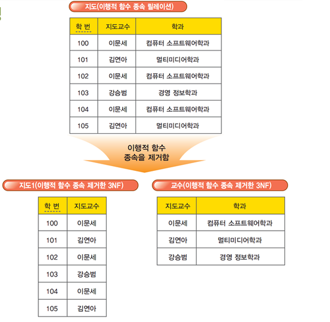
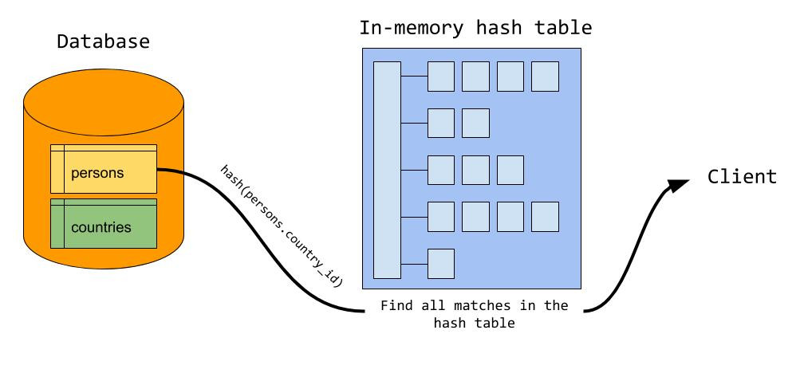

# 4.1 데이터베이스의 기본

- 데이터 베이스(DB, DataBase)
  - 일정한 규칙, 규약을 통해 구조화되어 저장되는 데이터의 모음
  - DBMS(DataBase Management System) : DB를 제어, 관리하는 통합 시스템
  - DB 안에 있는 데이터들은 쿼리 언어를 통해 삽입, 삭제, 수정, 조회 등을 할 수 있음
  - 실시간 접근, 동시 공유 가능
  - 

## 4.1.1 엔티티

- 엔티티(entity)
  - 사람, 장소, 물건, 사건, 개념 등 여러 개의 속성을 지닌 명사
  - 서비스의 요구 사항에 맞춰 속성 정해짐
  - 약한 엔티티 vs 강한 엔티티
    - A가 B의 존재 여부에 종속적이라면 A는 약한 엔티티, B는 강한 엔티티
    - A: 방, B : 건물

## 4.1.2 릴레이션

- 릴레이션(relation)

  - DB에서 정보를 구분하여 저장하는 기본 단위
  - DB는 엔티티에 관한 데이터를 릴레이션 하나에 담아 관리

- 테이블과 컬렉션
  - MySQL(관계형 DB) 구조 : 레코드-테이블-데이터베이스
  - MongoDM(NoSQL) 구조 : 도큐먼트-컬렉션-데이터베이스

## 4.1.3 속성

- 속성(attribute)
  - 릴레이션에서 관리하는 구체적이며 고유한 이름을 갖는 정보
  - 서비스의 요구사항을 기반으로 관리해야할 필요가 있는 속성들

## 4.1.4 도메인

- 도메인(domain)
  - 릴레이션에 포함된 각각의 속성들이 가질 수 있는 값의 집합
  - 예) 성별(속성) : 여자, 남자(도메인)

## 4.1.5 필드와 레코드


- 필드 : 학년,소속, 성명...
- 레코드(튜플) : 행 단위 데이터

- 필드 타입
  - 
  - CHAR : 레코드를 저장할 때 선언한 길이 값으로 고정해서 저장
    - 검색에 유리
  - VARCHAR : 가변 길이 문자열 :point_right: 입력한 데이터에 따라 용량을 가변시켜 저장
    - 검색을 별로 하지 않고 유동적인 길이를 가진 데이터에 유리
  - TEXT
    - 큰 문자열 저장
    - 주로 게시판 본문 저장
  - BLOB
    - 이미지, 동영상 등 큰 데이터 저장
    - 보통 아마존 이미지 호스팅 서버인 S3 같은 서버에 파일을 올리고 파일에 관한 경로를 VARCHAR로 저장
  - ENUM, SET : 공간적으로 이점 but 애플리케이션 수정에 따라 정의한 목록을 수정해야함
    - ENUM
      - 형태 : ENUM('x-small','small','medium','large','x-large) 중 하나만 선택
      - ENUM 리스트에 없는 잘못된 값을 삽입하면 빈 문자열이 입력됨
      - 장점 :x-small 등이 0,1 등으로 매핑되어 메모리를 적게 사용
      - 최대 65535개 요소
    - SET
      - 여러 개의 데이터를 선택할 수 있음
      - 비트 단위의 연산 가능
      - 최대 64개 요소

## 4.1.6 관계


### 1:1 관계


- 테이블을 두 개의 테이블로 나눠 테이블의 구조를 이해하기 쉽게 만듦

### 1:N 관계


- 한 개체가 다른 많은 개체를 포함하는 관계

### N:M 관계


- 테이블 두 개를 직접적으로 연결해서 구축하지 않고 1:N, 1:M 관계를 갖는 테이블 두 개로 나눠서 설정

## 4.1.7 키


- 기본키(Primary Key,PK, 프라이머리 키)
  - 유일성, 최소성
  - 테이블 데이터 중 고유하게 존재하는 속성(중복 불가)
  - 자연키 or 인조키
    - 자연키 : 중복된 값들을 제외하고 중복되지 않는 데이터를 지닌 키. 언젠가 변하는 속성
    - 인조키 : 인위적으로 생성 (예: 유저 아이디). 변하지 않는 속성 :point_right: 보통 기본키로 설정
      - 오라클 : sequence
      - MySQL : auto increment


- 외래키(Foreign Key,FK)

  - 다른 테이블의 키본키를 그대로 참조하는 값
  - 개체와의 관계를 식별
  - 중복 가능

- 후보키(candidate key)

  - 기본키가 될 수 있는 후보들
  - 유일성, 최소성

- 대체키(alternate key)

  - 후보키가 두 개 이상일 경우 하나를 기본키로 지정하고 남은 후보키들

- 슈퍼키(super key)
  - 각 레코드를 유일하게 식별할 수 있는 유일성을 갖춘 키

# 4.2 ERD와 정규화 과정

- ERD(Entity Relationship Diagram)
  - DB 구축 시 가장 기초적인 뼈대
  - 릴레이션 간의 관계 정의

## 4.2.1 ERD의 중요성

- ERD
  - 시스템의 요구 사항 기반으로 작성
  - DB 구축 이후에도 디버깅이나 비즈니스 프로세스 재설계가 필요할 경우 설계도 역할
  - 장점 : 관계형 구조로 표현할 수 있는 데이터를 구성하는 데 유용
  - 단점 : 비정형 데이터를 충분히 표현할 수 없다.
    - 비정형 데이터 : 비구조화 데이터
    - 미리 정의된 데이터 모델이 없거나 미리 정의된 방식으로 정리되지 않은 정보

## 4.2.2 예제로 배우는 ERD


## 4.2.3 정규화 과정

([이미지 출처](https://qwefgh90.github.io/_downloads/정규화참고.pptx))

- 정규화 과정
  - 릴레이션 간의 잘못된 종속 관계로 DB 이상 현상이 일어난 것을 해결
    - DB 이상 현상 : 중복 이상, 삭제 이상, 삽입 이상
  - 저장 공간을 효율적으로 사용하기 위해 릴레이션을 여러 개로 분리하는 과정
  - 정규화 과정이 좋은 성능을 보장하지는 않음
  - 정규화 원칙
    - 같은 의미를 표현하는 릴레이션이지만 더 좋은 구조로 만들어야 함
    - 자료의 중복성 감소
    - 독립적인 관계는 별개의 릴레이션으로 표현
    - 각각의 릴레이션은 독립적인 표현이 가능해야 한다
  - 제1정규형(1NF)
    - 
    - 릴레이션의 모든 도메인이 더 이상 분해될 수 없는 원자값으로만 구성
    - 릴레이션의 속성 값 중에서 한 개의 기본키에 대해 두 개 이상의 값을 가지는 반복 집합이 있어선 안됨
  - 제2정규형(2NF)
    - 
    - 릴레이션이 제1정규형이며 부분 함수의 종속성을 제거한 형태
    - 부분 함수의 종속성 제거 : 기본키가 아닌 모든 속성이 기본키에 완전 함수 종속적
    - 릴레이션을 분해할 때 동등한 릴레이션으로 분해해야 함
    - 정보 손실이 발생하지 않는 무손실 분해로 분해
  - 제3정규형(3NF)
    - 
    - 제2정규형이고 기본키가 아닌 모든 속성이 이행적 함수 종속(transitive FD)을 만족하지 않는 상태
      - 이행적 함수 종속 : A:point_right:B와 B:point_right:C 관계에서 A:point_right:C가 성립하게 될때 C가 A에 이행적으로 함수 종속되었다고 함
    - 보이스/코드 정규형(BCNF)
      - 
      - 3NF이고, 결정자가 후보키가 아닌 함수 종속 관계를 제거하여 릴레이션의 함수 종속 관계에서 모든 결정자가 후보키인 상태
        - 결정자
          - 함수 종속 관계에서 특정 종속자(dependent)를 결정짓는 요소
          - X:point_right:Y 일때 X는 결정자, Y는 종속자

# 4.3 트랜잭션과 무결성

## 4.3.1 트랜잭션

- 커밋과 롤백

  - 데이터의 무결성 보장
  - 데이터 변경 전에 변경 사항을 쉽게 확인 가능, 해당 작업 그룹화 가능
  - 커밋(commit)
    - 쿼리가 성공적으로 처리되었다고 확정하는 명령어
    - 트랜잭션 단위로 수행
    - 변경된 내용이 모두 영구적으로 저장
  - 롤백(rollback)
    - 트랜잭션으로 처리한 쿼리들을 일어나기 전으로 돌리는 일(취소)

- 트랜잭션
  - DB에서 하나의 논리적 기능을 수행하기 위한 작업의 단위
  - 여러 개의 쿼리들을 하나로 묶는 단위
  - 특징 : ACID
- 원자성(Atomity)

  - "all or nothing"
  - 트랜잭션과 관련된 일이 모두 수행되었거나 되지 않았거나를 보장
  - 문제가 생겨 롤백하는 경우 이전 트랜쿼리를 작성한 이후 모든 쿼리가 수행되지 않음
  - 트랜잭션 단위로 여러 로직들을 묶을 때 외부 API를 호출하는 것이 있으면 안됨
    - 있다면 롤백이 일어났을 때의 해결 방법이 필요
    - 트랜잭션 전파를 신경 써야 함
      - 트랜잭션 전파 : 커넥션 객체를 넘기지 않고 트랜잭션 관련 메서드의 호출을 하나의 트랜잭션에 묶어 수행
      - Spring의 @Transactional : 여러 관련 코드들을 하나의 트랜잭션으로 처리

- 일관성(consistency)

  - 허용된 방식으로만 데이터를 변경
  - DB의 모든 데이터는 규칙에 따라 유효함

- 격리성(isolation)
  - 트랜잭션 수행 시 서로 끼어들지 못함
  - 복수의 병렬 트랜잭션은 서로 격리되어 순차적으로 실행되는 것처럼 작동해야 함
  - DB는 여러 사용자가 같은 데이터에 접근할 수 있어야 함
  - 격리 수준
  - 
    - SERIALIZABLE
      - 트랜잭션을 순차적으로 실행
      - 여러 트랜잭션이 동시에 같은 행에 접근할 수 없음
      - 가장 엄격
      - 해당 행을 격리시키고 이후 이 행에 트랜잭션이 일어나면 기다려야 함
      - 교착 상태 발생 확률 높음
      - 가장 성능이 떨어짐
    - REPEATABLE_READ
      - 하나의 트랜잭션이 수정한 행을 다른 트랜잭션이 수정할 수 없지만 새로운 행 추가는 가능
      - 이후에 추가된 행이 발견될 수 있음
    - READ_COMMITTED
      - 가장 많이 사용되는 격리 수준
      - MySQL8.0, PostgreSQL, SQL_Server, 오라클의 기본값
      - READ_UNCOMMITTED 과 달리 다른 트랜잭션이 커밋하지 않은 정보는 읽을 수 없음 :point_right: 커밋 완료된 데이터만 조회 허용
      - 어떤 트랜잭션이 접근한 행을 다른 트랜잭션이 수정할 수 있음
    - READ_UNCOMMITTED
      - 가장 낮은 격리 수준
      - 하나의 트랜잭션이 커밋되기 이전에 다른 트랜잭션에 노출되는 문제가 있음
      - 가장 빠름
      - 데이터 무결성을 위해 지양하는 것이 이상적
      - 거대한 양의 데이터를 어림잡아 집계할 때 좋음
    - 팬텀 리드(phantom read)
      - 한 트랜잭션 내에서 동일한 쿼리를 보냈을 때 조회 결과가 다른 경우
      - 다른 행이 선택될 수도 있음을 의미
    - 반복 가능하지 않은 조회(non-repeatable-read)
      - 한 트랜잭션 내의 같은 행에 두 번 이상 조회가 발생했을 때 값이 다른 경우
      - 행 값이 달라질 수 있음을 의미
    - 더티 리드(dirty read)
      - 한 트랜잭션이 실행 중일 때 다른 트랜잭션에 의해 수정되었지만 '아직 커밋되지 않은' 행의 데이터를 읽을 수 있는 경우
- 지속성(durability)
  - 성공적으로 수행된 트랜잭션은 영원히 반영
  - DB에 시스템 장애가 발생해도 원래 상태로 복구하는 회복 기능이 있어야 함을 뜻함
  - 체크섬, 저널링, 롤백 등의 기능
    - 체크섬
      - 중복 검사
      - 오류 정정을 통해 송신된 자료의 무결성을 보호하는 단순한 방법
    - 저널링
      - 파일 시스템 또는 DB 시스템에 변경 사항을 반영(commit)하기 전에 로깅하는 것
      - 트랜잭션 등 변경 사항에 대한 로그를 남기는 것

## 4.3.2 무결성

- 무결성
  - 데이터의 정확성, 일관성, 유효성 유지
  - DB의 데이터 값과 현실 세계의 실제 값이 일치하는지에 대한 신뢰성
  - 종류
    |이름|설명|
    |---|---|
    |개체 무결성|기본키로 선택된 필드는 빈 값을 허용하지 않음|
    |참조 무결성|서로 참조 관계에 있는 두 테이블의 데이터는 항상 일관된 값 유지|
    |고유 무결성|특정 속성에 대해 고유한 값을 가지는 조건이 있는 경우 그 속 값은 모두 고유한 값을 가짐|
    |NULL 무결성|특정 속성 값에 NULL이 올 수 없다는 조건이 있을 경우 그 속성 값은 NULL이 될 수 없음|

# 4.4 데이터베이스의 종류

## 4.4.1 관계형 데이터베이스

- 관계형 데이터베이스(RDBMS)

  - 행과 열을 가지는 표 형식 데이터를 저장하는 형태의 DB
  - SQL을 써서 조작
  - MySQL, PostgreSQL, 오라클, SQL Server, MSSQL

- MySQL

  - C,C++로 만들어짐
  - MyISAM 인덱스 압축 기술
  - B-트리 기반의 인덱스
  - 스레드 기반의 메모리 할당 시스템
  - 빠른 조인
  - 최대 64개 인덱스
  - MySQL 스토리지 엔진 아키텍처
    - 
    - 모듈식 아키텍처로 쉽게 스토리지 엔진 변경 가능
    - 강점 : 데이터 웨어하우징, 트랜잭션 처리, 고가용성 처리
    - 스토리지 엔진 위에서 커넥터 API 및 서비스 계층을 통해 MySQL DB와 쉽게 상호작용
  - 쿼리 캐시 지원 : 쿼리 문에 대한 전체 경과 집합 저장
    - 사용자가 작성한 쿼리가 캐시에 있는 쿼리와 동일하면 서버가 구문 분석, 최적화 및 실행을 건너뛰고 캐시의 출력만 표시

- PostgreSQL
  - VACUUM : 디스크 조각이 차지하는 영역을 회수할 수 있는 장치
  - 최대 테이블 크기 32TB
  - SQL뿐만 아니라 JSON을 이용해서 데이터에 접근 가능
  - 지정 시간에 복구하는 기능, 로깅, 접근 제어, 중첩된 트랜잭션, 백업 등 가능

## 4.4.2 NoSQL 데이터베이스

- NoSQL(Not only SQL)
  - SQL을 사용하지 않는 DB
- MongoDB

  - JSON을 통해 데이터 접근 가능
  - Binary JSON(BJSON) 형태로 데이터 저장
  - 와이어드타이거 엔진이 장착된 키-값 데이터 모델에서 확장된 도큐먼트 기반의 DB
  - 뛰어난 확장성
  - 빅데이터 저장 시 좋은 성능
  - 고가용성, 샤딩, 레플리카셋 지원
  - 스키마를 정하지 않고 데이터 삽입 가능
    - 도메인의 DB를 기반으로 분석, 로깅 등을 구현할 때 강점
  - 도큐먼트를 생성할 때마다 다른 컬렉션에서 중복되지 않는 유니크한 값인 ObjectID 생성
  - 

- redis
  - 인메모리 DB이자 키-값 데이터 모델 기반의 DB
  - 기본 데이터 타입 : 문자열(string)
  - 최대 512MB 까지 저장
  - set, hash 지원
  - pub/sub 기능
    - 채팅 시스템
    - 다른 DB 앞단에 두어 사용하는 캐싱 계층
    - 단순한 키-값이 필요한 세션 정보 관리
    - sorted set 자료 구조를 이용한 실시간 순위표 서비스에 사용

# 4.5 인덱스

## 4.5.1 인덱스의 필요성


- 효율적인 단계를 거쳐 모든 요소에 접근 가능
  - 균형 잡힌 트리 구조와 트리 깊이의 대수확장성 때문
    - 대수확장성 : 트리 깊이가 리프 노드 수에 비해 매우 느리게 성장하는 것

## 4.5.2 B-트리

- [b-tree](./images/b-tree.png)
- 루트 노드부터 탐색이 일어나 브랜치 노드를 거쳐 리프 노드까지 내려옴

## 4.5.3 인덱스 만드는 방법

- MySQL

  - 클러스터형 인덱스
    - 테이블당 하나 설정 가능
    - primary key를 옵션으로 키본키로 만들면 생성 가능
    - 기본키 대신 unique not null 옵션으로도 생성 가능
  - 세컨더리 인덱스
    - create index... 기반으로 생성
    - 보조 인덱스로 여러 개의 필드 값을 기반으로 쿼리를 많이 보낼 때 생성해야 하는 인덱스
  - 하나의 인덱스만 생성할 거라면 클러스터형 인덱스가 성능이 좋음

- MongoDB
  - 도큐먼트를 만들면 자동으로 생성되는 ObjectID가 기본키
  - 세컨더리키도 부가적으로 설정해서 기본키와 함께 복합 인덱스 설정 가능

## 4.5.4 인덱스 최적화 기법

> MongoDB 기반 인덱스 최적화 기법

1. 인덱스는 비용이다.

   - 인덱스 리스트, 그다음 컬렉션 순으로 탐색하기 때문에 두 번 탐색해서 읽기 비용 발생
   - 컬렉션이 수정되었을 때 인덱스도 수정되어야 함
     - B-트리의 균형 있게 조절하는 비용 발생
     - 데이터를 효율적으로 조회할 수 있도록 분산시키는 비용 발생
   - 쿼리에 있는 필드에 인덱스를 다 설정하는 것은 좋지 않음
   - 컬렉션에서 가져와야 하는 양이 많을수록 인덱스 사용은 비효율적

2. 항상 테스팅하라

   - explain() 함수를 통해 인덱스를 만들고 쿼리를 보낸 이후에 테스팅을 하며 걸리는 시간 최소화
   - MySQL에서의 테스팅

```
EXPLAIN
SELECT * FROM t1
JOIN t2 ON t1.c1. = t2.c1
```

3. 복합 인덱스는 같음, 정렬, 다중 값, 카디널리티 순이다.
   1. ==이나 equal 쿼리가 있다면 제일 먼저 인덱스로 설정
   2. 정렬에 쓰는 필드라면 그 다음 인덱스로 설정
   3. 다중 값을 출력해야 하는 필드, 즉 >, < 등 많은 값을 출력해야 하는 쿼리를 쓰는 필드라면 나중에 인덱스 설정
   4. 유니크한 값의 정도(카디널리티)가 높은 순서대로 인덱스 생성 (카디널리티 : email > age)

# 4.6 조인의 종류

- 조인(join) : 하나의 테이블이 아닌 두 개 이상의 테이블을 묶어서 하나의 결과물을 만드는 것
- MySQL : JOIN
- MongoDB : lookup
  - lookup을 사용하면 RBDMS보다 성능이 떨어져서 되도록 지양
- 여러 테이블을 조인하는 작업이 많을 경우 RDBMS를 써야 함
  
- 내부 조인(inner join) : 왼쪽 테이블과 오른쪽 테이블에서 두 행이 모두 일치하는 부분만 조회
  - 두 테이블 간의 교집합
- 왼쪽 조인(left outer join) : 왼쪽 테이블의 모든 행 조회
  - 테이블 B에 일치하는 부분과 함께 테이블 A 기준으로 레코드 집합 생성
  - B에 일치하는 항목이 없으면 해당 값은 null이 됨
- 오른쪽 조인(left outer join) : 오른쪽 테이블의 모든 행 조회
  - 테이블 A에 일치하는 부분과 함께 테이블 B 기준으로 레코드 집합 생성
  - A에 일치하는 항목이 없으면 해당 값은 null이 됨
- 합집합 조인(full outer join) : 조인 조건에 만족하지 않는 행까지 모두 조회
  - 양쪽 테이블에서 일치하는 레코드와 함께 A, B의 모든 레코드 집합 생성
  - 일치하는 항목이 없으면 누락된 쪽에 null 값이 포함

# 조인의 원리

## 4.7.1 중첩 루프 조인

- 중첩 루프 조인(NLJ, Nested Loop Join)
  - 중첩 for 문과 같은 원리
  - 랜덥 접근에 대한 비용이 많이 증가하므로 대용량 테이블에서는 사용하지 않음
  - 블록 중첩 루프 조인(BNL, Block Nested Join) : 조인할 테이블을 작은 블록으로 나눠서 블록 하나씩 조인

## 4.7.2 정렬 병합 조인

- 정렬 병합 조인
  - 각각의 테이블을 조인할 필드 기준으로 정렬하고 정렬이 끝난 후에 조인 작업 수행
  - 조인할 때 쓸 적절한 인덱스가 없거나
  - 대용량의 테이블들을 조인하거나
  - 조인 조건으로 <, > 등 범위 ㅇ비교 연산자가 있을 때 사용

## 4.7.3 해시 조인

- 해시 조인
  - 해시 테이블 기반 조인
  - 하나의 테이블이 메모리에 온전히 들어간다면 NLJ보다 효율적
  - 메모리에 올릴 수 없을 정도로 크다면 디스크 사용 비용 발생
  - 동등(=) 조인에서만 사용 가능
  - MySQL의 해시 조인 단계
    
    - 빌드 단계
      - 입력 테이블 중 하나를 기반으로 메모리 내 해시 테이블을 빌드
      - 두 테이블을 조인한다면 둘 중 바이트가 더 작은 테이블을 기반으로 빌드
      - 조인에 사용되는 필드가 해시 테이블의 키로 사용
    - 프로브 단계
      - 레코드를 읽기 시작해서 각 레코드에서 빌드 단계에서 생성된 키에 일치하는 레코드를 찾아서 결괏값으로 반환
      - 각 테이블은 한 번씩만 읽게 되어 NLJ보다 성능 좋음
      - 사용 가능한 메모리양은 시스템 변수 join_buffer_join에 의해 제어되고, 런타임 시에 조정 가능
