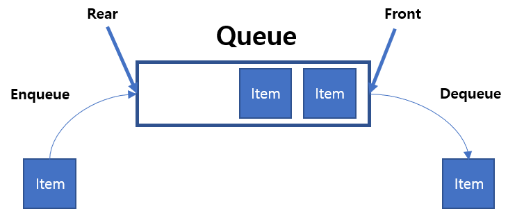

# 5.1 복잡도

## 5.1.1 시간 복잡도

- 시간 복잡도
  - 문제를 해결하는 데 걸리는 시간과 입력의 함수 관계
  - 알고리즘 로직의 수행 시간을 나타냄
  - 빅오 표기법
    - 입력 범위 n을 기준으로 로직이 몇번 반복되는지 나타냄
    - 가장 영향이 큰 항의 상수 인자를 빼고 나머지 항을 없앤 값
  - 속도 비교
    

## 5.1.2 자료 구조에서의 시간 복잡도

# 5.2 선형 자료 구조

- 선형 자료 구조 : 요소가 일렬로 나열되어 있는 자료 구조

## 5.2.1 연결 리스트

- 연결 리스트
  - 데이터를 담은 노드를 포인터로 연결해서 효율성을 극대화시킨 자료 구조
  - 삽입, 삭제 : O(1)
  - 탐색 : O(n)
  - 
  - 싱글 연결 리스트 : next 포인터만 가짐
  - 이중 연결 리스트 : next, prev 포인터 가짐
  - 원형 이중 연결 리스트 : 이중 연결 리스트와 같지만 마지막 노드의 next 포인터가 페드 노드를 가리킴

## 5.2.2 배열

- 배열(array)
  - 같은 타입의 변수들로 이루어짐
  - 크기가 정해짐
  - 인접한 메모리 위치에 있는 데이터를 모아놓은 집합
  - 중복 허용
  - 순서 o
  - 인덱스에 해당하는 원소를 빠르게 접근해야 하거나 간단하게 데이터를 쌓고 싶을 때 사용
  - 정적 배열 기준
    - 탐색 : O(1) -> 랜덤 접근 가능
    - 삽입, 삭제 : O(n)
  - 데이터 추가와 삭제를 많이 한다면 연결 리스트
  - 탐색을 많이 하는 것은 배열

- 랜덤 접근(직접 접근)
  - 동일한 시간에 임의의 인덱스에 해당하는 데이터에 접근 가능
- 순차적 접근

  - 데이터를 저장된 순서대로 검색

- 배열과 연결 리스트 비교
  - 배열
    - 데이터를 순서대로 나열
    - 인덱스로 요소 조회 가능
    - 탐색 빠름
    - 삭제 느림 (삭제 후 데이터를 앞으로 옮겨야 하기 때문)
  - 연결 리스트
    - 데이터를 연결한 구조
    - 특정 데이터를 보려면 모든 데이터를 조회해야 함
    - 탐색 느림
    - 삭제 빠름 (연결만 다시 하면 됨)

## 5.2.3 벡터

- 벡터(vector)
  - 동적으로 요소를 할당할 수 있는 동적 배열
  - 컴파일 시점에 데이터 개수를 모를 때 사용
  - 중복 허용
  - 순서 o
  - 랜덤 접근 가능
  - 탐색, 맨 마지막 요소 삭제,삽입 : O(1)
    - 벡터의 크기가 증가되는 시간 복잡도가 상수 시간 복잡도 O(1) (amortized 복잡도)과 유사한 시간 복잡도를 가지기 때문

## 5.2.4 스택

- 스택
  - LIFO(Last In First Out)
  - 재귀 함수, 알고리즘에 사용
  - 웹 브라우저 방문 기록 등에 사용
  - 삽입, 삭제 : O(1)
  - 탐색 : O(n)

## 5.2.5 큐

- 큐
  - FIFO(First In First Out)
  - CPU 작업을 기다리는 프로세스, 스레드 행렬, 네트워크 접속을 기다리는 행렬, BFS, 캐시 등에 사용
  - 삽입, 삭제 : O(1)
  - 탐색 : O(n)

# 5.3 비선형 자료 구조

- 비선형 자료 구조
  - 데이터를 일렬로 나열하지 않고 자료 순서나 관계가 복잡한 구조
  - 트리, 그래프

## 5.3.1 그래프

- 그래프
  - 정점(vertex), 간선(edge)으로 이루어진 자료 구조
    - 정점은 보통 v 또는 u라고 함
    - 어떤 정점에서 어떤 정점까지 간다 == u에서부터 v로 간다
    - outdegree : 한 정점에서 정점으로 나가는 간선
    - indegree : 한 정점에서 정점으로 들어오는 간선
  - 가중치(weight)
    - 간선과 정점 사이에 드는 비용
