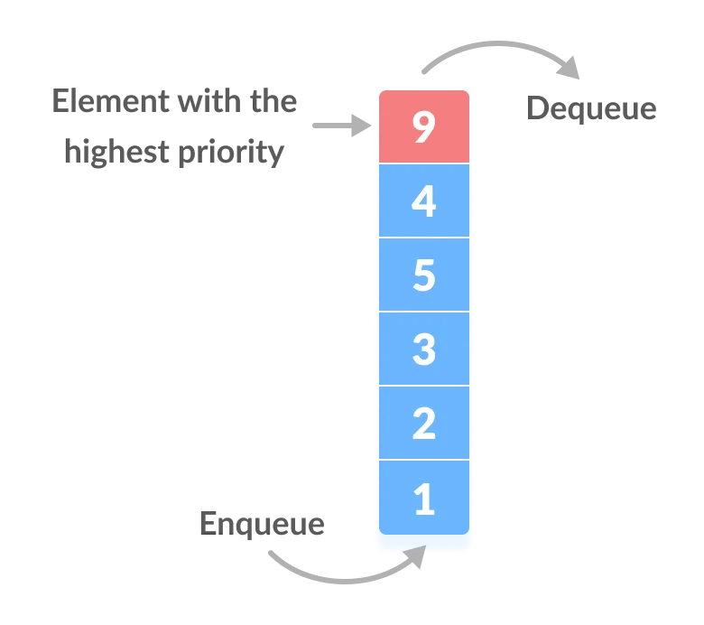

# 5.1 복잡도

## 5.1.1 시간 복잡도

- 시간 복잡도
  - 문제를 해결하는 데 걸리는 시간과 입력의 함수 관계
  - 알고리즘 로직의 수행 시간을 나타냄
  - 빅오 표기법
    - 입력 범위 n을 기준으로 로직이 몇번 반복되는지 나타냄
    - 가장 영향이 큰 항의 상수 인자를 빼고 나머지 항을 없앤 값
  - 속도 비교
    

## 5.1.2 자료 구조에서의 시간 복잡도

# 5.2 선형 자료 구조

- 선형 자료 구조 : 요소가 일렬로 나열되어 있는 자료 구조

## 5.2.1 연결 리스트

- 연결 리스트
  - 데이터를 담은 노드를 포인터로 연결해서 효율성을 극대화시킨 자료 구조
  - 삽입, 삭제 : O(1)
  - 탐색 : O(n)
  - 
  - 싱글 연결 리스트 : next 포인터만 가짐
  - 이중 연결 리스트 : next, prev 포인터 가짐
  - 원형 이중 연결 리스트 : 이중 연결 리스트와 같지만 마지막 노드의 next 포인터가 페드 노드를 가리킴

## 5.2.2 배열

- 배열(array)
  - 같은 타입의 변수들로 이루어짐
  - 크기가 정해짐
  - 인접한 메모리 위치에 있는 데이터를 모아놓은 집합
  - 중복 허용
  - 순서 o
  - 인덱스에 해당하는 원소를 빠르게 접근해야 하거나 간단하게 데이터를 쌓고 싶을 때 사용
  - 정적 배열 기준
    - 탐색 : O(1) -> 랜덤 접근 가능
    - 삽입, 삭제 : O(n)
  - 데이터 추가와 삭제를 많이 한다면 연결 리스트
  - 탐색을 많이 하는 것은 배열

- 랜덤 접근(직접 접근)
  - 동일한 시간에 임의의 인덱스에 해당하는 데이터에 접근 가능
- 순차적 접근

  - 데이터를 저장된 순서대로 검색

- 배열과 연결 리스트 비교
  - 배열
    - 데이터를 순서대로 나열
    - 인덱스로 요소 조회 가능
    - 탐색 빠름
    - 삭제 느림 (삭제 후 데이터를 앞으로 옮겨야 하기 때문)
  - 연결 리스트
    - 데이터를 연결한 구조
    - 특정 데이터를 보려면 모든 데이터를 조회해야 함
    - 탐색 느림
    - 삭제 빠름 (연결만 다시 하면 됨)

## 5.2.3 벡터

- 벡터(vector)
  - 동적으로 요소를 할당할 수 있는 동적 배열
  - 컴파일 시점에 데이터 개수를 모를 때 사용
  - 중복 허용
  - 순서 o
  - 랜덤 접근 가능
  - 탐색, 맨 마지막 요소 삭제,삽입 : O(1)
    - 벡터의 크기가 증가되는 시간 복잡도가 상수 시간 복잡도 O(1) (amortized 복잡도)과 유사한 시간 복잡도를 가지기 때문

## 5.2.4 스택

- 스택
  - LIFO(Last In First Out)
  - 재귀 함수, 알고리즘에 사용
  - 웹 브라우저 방문 기록 등에 사용
  - 삽입, 삭제 : O(1)
  - 탐색 : O(n)

## 5.2.5 큐

- 큐
  - FIFO(First In First Out)
  - CPU 작업을 기다리는 프로세스, 스레드 행렬, 네트워크 접속을 기다리는 행렬, BFS, 캐시 등에 사용
  - 삽입, 삭제 : O(1)
  - 탐색 : O(n)

# 5.3 비선형 자료 구조

- 비선형 자료 구조
  - 데이터를 일렬로 나열하지 않고 자료 순서나 관계가 복잡한 구조
  - 트리, 그래프

## 5.3.1 그래프

- 그래프
  - 정점(vertex), 간선(edge)으로 이루어진 자료 구조
    - 정점은 보통 v 또는 u라고 함
    - 어떤 정점에서 어떤 정점까지 간다 == u에서부터 v로 간다
    - outdegree : 한 정점에서 정점으로 나가는 간선
    - indegree : 한 정점에서 정점으로 들어오는 간선
  - 가중치(weight)
    - 간선과 정점 사이에 드는 비용

## 5.3.2 트리

- 트리
  
  - 그래프 중 하나로 정점과 간선으로 이루어짐
  - 계층적 데이터의 집합
  - 트리의 특징
    - 부모, 자식 계층 구조를 가짐
    - V - 1 = E (간선 수 = 노드 수 -1)
    - 임의의 두 노드 사이 경로는 유일무이 -> 트리 내의 어떤 노드와 어떤 노드까지의 경로는 반드시 존재
  - 구성
    - 루트 노드
      - 가장 위에 있는 노드
      - 트리 문제에서 루트 노드를 중심으로 탐색하면 쉽게 풀리는 경우가 많음
    - 내부 노드
      - 루트 노드와 내부 노드 사이에 있는 노드
    - 리프 노드
      - 자식 노드가 없는 노드
  - 트리의 높이와 레벨
    - 깊이 : 루트 노드부터 특정 노드까지 최단 거리로 갔을 때의 거리
    - 높이 : 루트 노드부터 리프 노드까지 거리 중 가장 긴 거리
    - 레벨 : 보통 깊이와 같은 의미
    - 서브트리 : 트리 내의 하위 집합(부분 집합)
  - 이진 트리
    
    - 자식의 노드 수가 두개 이하인 트리
      - 정이진 트리(full bianry tree) : 자식 노드가 0 또는 두 개인 이진 트리
      - 완전 이진 트리(complete binary tree) : 마지막 레벨을 제외하고 모든 레벨이 왼쪽에서부터 완전히 채워져 있는 이진 트리
      - 변질 이진 트리(degenerate binary tree) : 자식 노드가 하나밖에 없는 이진 트리
      - 포화 이진 트리(perfect binary tree) : 모든 노드가 꽉 차 있는 이진 트리
      - 균형 이진 트리(balancsed binary tree)
        - 왼쪽과 오른쪽 노드의 높이 차이가 1 이하인 이진 트리
        - map, set을 구성하는 레드 블랙 트리
  - 이진 탐색 트리(BST)
    - 노드의 오른쪽 하위 트리에는 노드 값보다 큰 값, 왼쪽 하위 트리에는 노드 값보다 작은 값이 들어 있는 트리
    - 탐색 : O(logn) / 최악: O(n) -> 삽입 순서에 따라 선형적일 수 있어서
  - AVL 트리(Adelson-Velsky and Landis tree)
    
    - 최악의 경우 선형적인 트리가 되는 것을 방지하고 스스로 균형을 잡는 BST
    - 두 자식 서브트리의 높이는 항상 최대 1만큼 차이
    - 탐색, 삽입, 삭제 : O(logn)
    - 삽입, 삭제를 할 때마다 균형이 안 맞는 것을 맞추기 위해 트리 일부를 왼쪽 or 오른쪽으로 회전시키며 균형 잡음
  - 레드 블랙 트리
    
    - 균형 이진 탐색 트리
    - 모든 리프 노드와 루트 노드는 블랙이고, 어떤 노드가 레드이면 그 노드의 자식은 반드시 블랙
    - 탐색, 삽입, 삭제 : O(logn)
    - 각 노드는 빨간색 또는 검은색의 색상을 나타내는 추가 비트 저장
      - 삽입, 삭제 중에 트리가 균형을 유지하는 데에 사용
    - C++ STL의 set, miltiset, map, multimap 구현 원리

## 5.3.3 힙

- 힙
  
  - 완전 이진 트리 기반
  - 최대힙
    - 루트 노드에 있는 키는 모든 자식에 있는 키 중에서 가장 커야 함
    - 각 노드의 자식 노드와의 관계도 재귀적으로 이루어짐
    - 삽입 : 새로운 노드를 마지막 노드에 삽입하고 부모 노드들과의 크기를 비교하며 교환해서 최대힙으로 만듦
      
    - 삭제 : 최댓값인 루트 노드를 삭제하고 마지막 노드와 루트 노드의 스왑을 반복해 재구성
  - 최소힙
    - 루트 노드에 있는 키는 모든 자식에 있는 키 중에서 가장 작아야 함
    - 각 노드의 자식 노드와의 관계도 재귀적으로 이루어짐

## 5.3.4 우선순위 큐

- 우선순위 큐
  
  - 우선순위 대기열
  - 대기열에서 우선순위가 높은 요소가 우선 순위가 낮은 요소보다 먼저 제공
  - 힙 기반 구현
