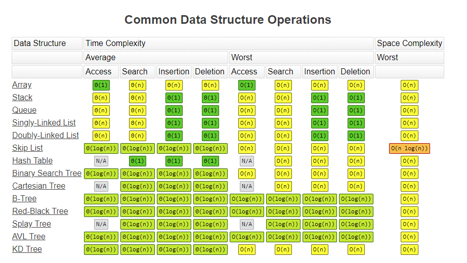

# 5. 자료 구조(data structure)
- 효율적으로 데이터를 관리하고 수정, 삭제, 탐색, 저장할 수 있는 데이터 집합

# 5.1 복잡도
# 5.1.1 시간 복잡도
## 빅오 표기법
- 시간 복잡도
  - 문제를 해결하는 데 걸리는 시간과 입력의 함수 관계
  - 보통 빅오 표기법으로 나타냄
    - 입력 크기 n을 기준으로 하여 로직이 몇 번 반복되는지 나타낸 것
    - 필요 시간이 `10n^2 + n`이면, 시간 복잡도는 O(n^2)
    - 가장 영향이 큰 항의 상수 인자만 빼고 나머지는 무시한다.
  
## 시간 복잡도의 존재 이유
- 걸리는 시간이 짧은 효율적인 코드로 개선하기 위해

## 시간 복잡도의 속도 비교
- O(1) > O(logn) > O(n) > O(n^2)
- n이 커질수록 속도 차이가 커진다.

 

# 5.1.2 공간 복잡도
- 프로그램을 실행시켰을 때 필요로 하는 자원 공간의 양
- 정적 변수로 선언된 것, 재귀함수로 인해 동적으로 공간을 계속해서 필요로 할 경우 둘다 포함

 

# 5.1.3 자료 구조에서의 시간 복잡도
- 자료 구조를 쓸 때는 시간 복잡도를 고려해야 한다.
- 보통 평균, 최악의 시간복잡도를 참고한다.

 

# 5.2 선형 자료 구조
- 요소가 일렬로 나열된 자료 구조

# 5.2.1 연결 리스트
- 데이터를 감싼 노드를 포인터로 연결해서 공간적 효율성을 극대화시킨 자료구조
- 시간 복잡도
  - 삽입, 삭제: O(1) 걸림
  - 탐색: O(n) 걸림
- prev 포인터, next 포인터로 앞 뒤 노드를 연결시킴
- 종류
  - 싱글 연결 리스트: next 포인터만 가짐
  - 이중 연결 리스트: next 포인터와 prev 포인터 가짐
    - 함수 종류
      - push_front(): 요소를 앞에서부터 넣음
      - push_back(): 요소를 뒤에서부터 넣음
      - insert(): 요소를 중간에 넣음
  - 원형 이중 연결 리스트: 이중 연결 리스트와 같지만 마지막 노드의 next 포인터가 헤드 노드를 가리킴
    - 헤드(head): 맨 앞 노드

 

# 5.2.2 배열(array)
- *여기서는 '정적 배열' 기반으로 설명*
- 같은 타입의 변수들로 이루어짐
- 크기가 정해져 있음
- 인접한 메모리 위치에 있는 데이터들의 집합
- 중복 허용
- 순서 있음
- 시간 복잡도
  - 접근: O(1)이어서 랜덤 접근(random access) 가능
  - 삽입, 삭제: O(n) 걸림
    - 데이터 삽입, 삭제를 많이 한다면 연결리스트 사용 권장
    - 배열은 해당 인덱스의 원소에 빠르게 접근해야 하거나, 간단하게 데이터를 쌓고 싶을 때 사용

## 랜덤 접근과 순차적 접근
- 랜덤 접근(직접 접근)
  - 배열과 같은 순차적인 데이터가 있을 때 임의의 인덱스에 해당하는 데이터에 접근할 수 있는 기능
- 순차적 접근
  - 데이터를 저장된 순서대로 검색

## 배열과 연결 리스트 비교
- 배열
  - 상자를 순서대로 나열한 데이터 구조
  - 탐색이 빠름
    - 몇 번째 상자인지만 알면 해당 상자의 요소를 끄집어낼 수 있다
  - 데이터 추가 및 삭제가 느림
    - 모든 상자를 앞으로 옮겨야 추가 가능
- 연결 리스트
  - 상자를 선으로 연결한 형태의 데이터 구조
  - 탐색이 느림
    - 상자 안의 요소를 알려면 주어진 선을 기반으로 상자를 순차적으로 열어봐야 한다.
  - 데이터 추가 및 삭제가 빠름
    - 선을 바꿔서 연결해주기만 하면 추가 가능

 

# 5.2.3 벡터(vector)
- 동적으로 요소를 할당할 수 있는 동적 배열
- 컴파일 시점에 개수를 모른다면 벡터를 사용해야 함
- 중복 허용
- 순서 있음
- 랜덤 접근 가능
- 시간 복잡도
  - 탐색, 맨 뒤의 요소를 삭제 또는 삽입: O(1)
    - 뒤에서부터 요소를 삽입할 때 벡터의 크기가 증가할 수 있다.
      - 꽉 찬 벡터에 삽입하려고 할 경우에만 크기를 두 배로 늘려 2^n의 크기를 유지한다.
      - 벡터 크기를 늘리는 과정의 시간복잡도: O(1) 
  - 맨 뒤나 맨 앞이 아닌 요소를 삭제 또는 삽입: O(n)
- 함수
  - push_back(): 뒤부터 요소를 더함
  - pop_back(): 뒤부터 요소를 지움
  - erase(): 지움
  - find(): 요소 찾기
  - clear(): 배열 초기화

 

# 5.2.4 스택
- 마지막으로 들어간 데이터가 가장 먼저 나오는 성질(LIFO, Last In First Out)을 가진 자료구조
- 재귀함수, 알고리즘, 웹 브라우저 방문 기록 등에 쓰임
- 시간 복잡도
  - 삽입 및 삭제: O(1)
  - 탐색: O(n)

 

